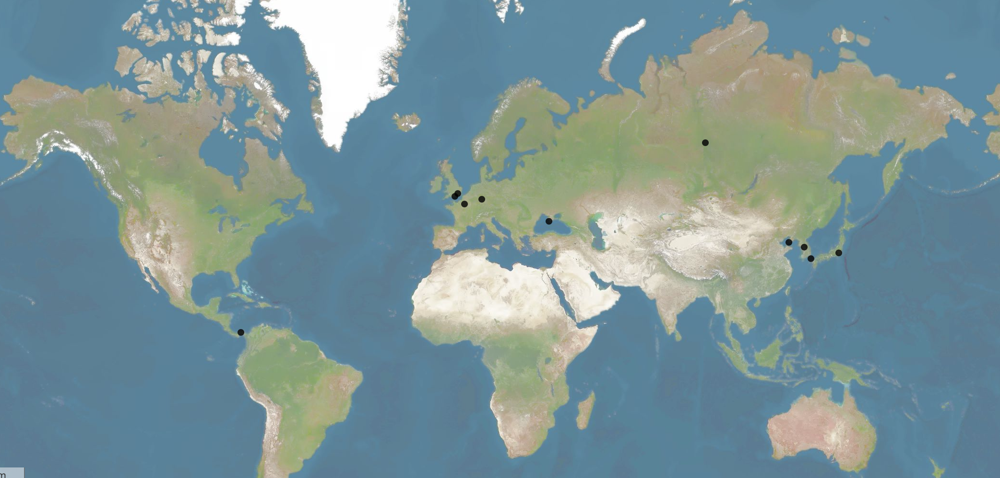

Layout: page
title: "Diplomatic Influence of Major Nations"
teaser: "A look into the effect of major global events as evident in the Egyptian Gazette's writers"
date: 2016-12-3
author: Logan Wills
tags: -Diplomacy-Writers-egyptian-gazette-OCR-microfilm
header: "Diplomatic Influence on Egpyt"
image:
thumb:

####Diplomatic Influence of Major Nations
   
   In the time of the Egyptian Gazette, and specifically the year 1905, many of the worlds 
major powers resided in Europe and Asia, while the continent of Africa was behind.  For my 
cereal question, I would like to take a look into the influence some of these major European and 
Asian powers had evident in the Egyptian newspaper.  More specifically, I would like to look into 
the results of the Anglo-Japanese Treaty, how it upset Russia, and the preparedness of Egypt in 
he case of a global conflict.  Along with looking into these storylines throughout the issue, I 
would like to create an interactive map of sorts, labeling the main positions of these storylines.  
If the user was to select a point on the map, a brief explanation of the situation, along with a 
date would show up.  In my analysis I would like generally discuss Egypt’s reactions, their 
opinions on the global treaties, as well as the effects of the agreements between foreign 
nations.  I would mostly like to focus on the influence of England, and the resulting reactions of 
Russia to movements made by the English, as they would regularly lead to a series of other 
reactions.  Querying has resulted in a good amount of topics regarding Egyptian-English 
relations, as well as on the topic of the Anglo-Japanese Treaty, and through varying the search 
queries, plenty of data is available regarding this topic.    
    The visual aid of this project is a map utilizing the app Palladio.  After spending hours 
attempting to find a way to save the Palladio file, the discovery of there being no way was made.
In order for the map to be viewed, the text line at the bottom of this blog must be copied and 
pasted into an editing software, such as oxygen.  Once the line of text has been pasted, this 
oxygen file must be saved.  Using the second link at the bottom of the page, select load an existing
project, then upload this saved oxygen file to this page, and the map will become visible.  

**Copy and paste this line into an editor software, save it, upload to page in next URL:**
{"version":"1.2.4","files":[{"loadFromURL":false,"label":"Untitled","id":0,"autoFields":[],"fields":[{"key":"Place","description":"Place","cardinality":11,"type":"text","blanks":0,"uniques":[],"uniqueKey":false,"special":[],"unassignedSpecialChars":[],"countBy":false,"errors":[],"descriptiveField":"Name of Event/Description","$$hashKey":"object:116"},{"key":"Latitude, Longtitude","description":"Latitude, Longtitude","cardinality":11,"type":"latlong","blanks":0,"uniques":[],"uniqueKey":false,"special":[",","-"],"unassignedSpecialChars":[],"countBy":false,"errors":[],"descriptiveField":"Name of Event/Description","$$hashKey":"object:117","existenceDimension":"0.u97dbp6td49"},{"key":"Name of Event/Description","description":"Name of Event/Description","cardinality":12,"type":"text","blanks":0,"uniques":[],"uniqueKey":true,"special":["-",",","/"],"unassignedSpecialChars":["-",",","/"],"countBy":true,"errors":[],"$$hashKey":"object:118","verifiedSpecialChars":["-",",","/"],"confirmed":true,"countable":true,"countDescription":"Untitled"},{"key":"","description":"","cardinality":0,"type":"null","blanks":12,"uniques":[],"uniqueKey":false,"special":[],"unassignedSpecialChars":[],"countBy":false,"errors":[],"descriptiveField":"Name of Event/Description","$$hashKey":"object:119","delete":true}],"data":[{"Place":"Frankfurt","Latitude, Longtitude":"50.1109221,8.6821267","Name of Event/Description":"Treaty of Frankfurt/Ended Franco-Prussian War, but would have lasting diplomatic impacts","":""},{"Place":"Paris","Latitude, Longtitude":"48.856614,2.3522219","Name of Event/Description":"Treaty of Paris/Spain ending reliquinshing almost all its territory in the Americas","":""},{"Place":"London","Latitude, Longtitude":"51.5073509,-0.1277583","Name of Event/Description":"Anglo-Japanese Treaty/Represented a friendship between England and Japan, and was the first of its kind","":""},{"Place":"Paris","Latitude, Longtitude":"48.856614,2.3522219","Name of Event/Description":"Hispano-American Treaty of Peace/Treaty between U.S and Spain than ended Spanish colonies in America","":""},{"Place":"Panama City","Latitude, Longtitude":"9.1011785,-79.4028639","Name of Event/Description":"Panama Canal Treaty/Established the Panama Canal zone for U.S and Panama","":""},{"Place":"Pourtsmouth","Latitude, Longtitude":"50.8197675,-1.0879769","Name of Event/Description":"Treaty of Portsmouth/Officially ended the Russo-Japanese War","":""},{"Place":"Hanseong","Latitude, Longtitude":"37.566535,126.9779692","Name of Event/Description":"Japan-Korea Treaty of 1905/Created an aliiance between Korea and Japan to protect against Russia","":""},{"Place":"Berezovye Islands","Latitude, Longtitude":"61.6816667,90.5466667","Name of Event/Description":"Treaty of Bjorko/Secret Treaty of defense between the German Empire and Russia","":""},{"Place":"L�shunkou","Latitude, Longtitude":"38.851705,121.261953","Name of Event/Description":"Battle of Port Arthur/Marked the commencment of the Russo-Japanese War","":""},{"Place":"Tokyo","Latitude, Longtitude":"35.6894875,139.6917064","Name of Event/Description":"BATTLE OF HEI-KOU-TAI/Major battle resulting in a stalemate, and started the downfall of Russia in the War","":""},{"Place":"Sevastopol","Latitude, Longtitude":"44.61665,33.525367","Name of Event/Description":"Sevastopol Mutiny/Major armed revolt in the Black Sea Fleet against Russia","":""},{"Place":"Straits of Tsushima","Latitude, Longtitude":"34.0,129.5","Name of Event/Description":"Battle of Tsushima/Another Japanese decisive victory spelling the end for Russia's chances of victory","":""}],"uniqueId":0,"$$hashKey":"object:110"}],"links":[],"layout":"geo","metadata":{"title":null,"author":null,"date":null,"description":null},"vis":[{"type":"palladioFilters","importJson":{"facets":[],"timelines":[],"partimes":[],"timesteps":[]}},{"type":"graphView","importJson":{"showLinks":true,"showLabels":true,"aggregateKey":null,"aggregationType":"COUNT","nodeSize":false,"highlightSource":false,"highlightTarget":false,"aggDimKey":"Name of Event/Description","sourceDimension":null,"targetDimension":null,"fixedNodes":false}},{"type":"mapView","importJson":{"tileSets":[{"url":null,"mbId":"cesta.k8gof2np","enabled":true,"description":"Latitude, Longtitude"},{"url":null,"mbId":"cesta.k8ghh462","enabled":true,"description":"Latitude, Longtitude"},{"url":null,"mbId":"cesta.hd9ak6ie","enabled":true,"description":"Land"}],"layers":[{"aggDescription":"Number of Untitled","aggregateKey":null,"aggregationType":"COUNT","color":"#000000","countBy":"Name of Event/Description","description":"Latitude, Longtitude","enabled":true,"layerType":"data","descriptiveDimKey":"Name of Event/Description","mapping":{"sourceCoordinatesKey":"Latitude, Longtitude","sourceCoordinatesType":null,"sourceCoordinatesDescription":"Latitude, Longtitude","destinationCoordinatesKey":null,"destinationCoordinatesType":null,"destinationCoordinatesDescription":null},"showLinks":false,"type":"points"}]}},{"type":"tableView","importJson":{"tableDimensions":[],"countDim":null,"maxDisplay":1000}},{"type":"listView","importJson":{"titleDim":"Name of Event/Description"}}]}

**URL to upload saved file to:**
http://hdlab.stanford.edu/palladio-app/#/upload
