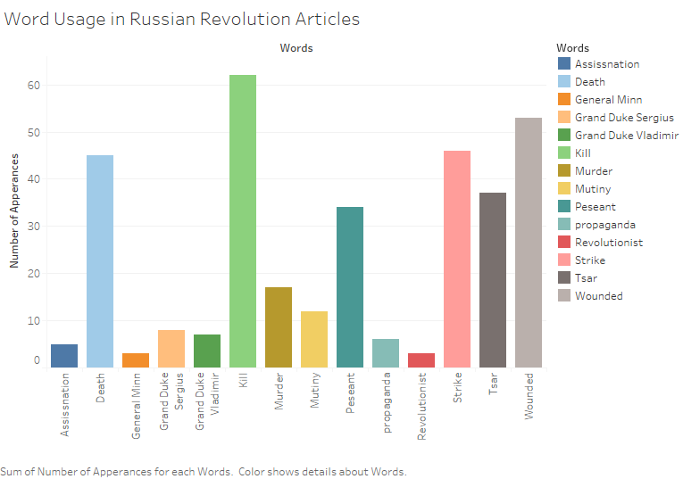

While looking through the Egyptian Gazette I found a plethora of interesting articles on varying subjects, but the most interesting articles to me where about the Russian Revolution that took place from January 1905 – July 1907. I had very little knowledge on this topic beforehand, not knowing that it even existed. Even though I had no knowledge of it and thought it was unimportant it seemed like a major concern the readers of the Egyptian Gazette. With this in mind I wanted to explore the question: What role did the Russian Revolution play within the lives on the readers of the Egyptian Gazette?

To understand and conduct this research question I had to know about the Russian Revolution. The Russian Revolution started in January of 1905 due to 4 main problems that the Russian government had. The first problem was the social structure which revolved around how land was handled amongst people. A couple of years before the revolution serfdom was ended and new laws were implemented for peasants to be able to own land. The peasants would pay small payments over a large time, but the peasants would work as a community owning the land in order to pay. The problem with this that the land was not enough for them to support themselves. Along with this problem they also had to pay taxes to government for owning land which made it incredibly difficult to live.

Another problem that contributed to the Russian Revolution was that the Russian economy was in a slump. The Russian government was spending too much on was supplies, the economy was importing foreign goods while not producing any agriculture to ship out and the price of grain dropped. These factors led to the along with the taxes and community payments led to anger amongst the peasants.
The educated class was also dissatisfied with the government. Before the revolution Tsar Alexander II abolished serfdom and lifted restrictions on university. This allowed many to go into universities and express their ideas in forms that they could not achieve before due to the lack of knowledge. Due to these reforms the educate class became out spoken and started talking against the government, which led to the government putting restrictions on education. This led to anger amongst the educated class.

The war was between Russian Government and nobility against working class, peasants, and the lower educated class. In the end the Russian government won, but many new laws and a new constitution were set in place to appease the revolutionist.  

To answer the question on what role did the Russian Revolution play within the lives on the readers of the Egyptian Gazette, I used an X-path query. It took many tries to get to the right results and even then, there were still problems. The main and most significant X-path query that was used is //div[@type=“item”][contains(., “Russia”) and contains(., “revolution”)]. This produced an item that contained the word “Russia” and any word that contained “revolution” such as revolutionary. I noticed that this only produced one item per page, but when reading them I notice that many times there were several more articles on the Russian revolution. Those articles didn’t use both “Russia” and” “revolution” because they already used it earlier. To solve this problem, I read each section that my query gave results for. This helped me and in two ways, one it gave me a better understanding on how the newspaper reported the Russian revolution and it also helped me create better quarries to help me look up certain questions I had.

When I went through my query the first time I took notes on certain people, places, and things I thought were valuable. I also recorded the dates that month and year that the words “Russia” and “revolution” appeared on to understand if the Russian revolution was more discussed upon at certain dates. This led me to create this bar graph:

This graph shows many things, one of which is that the Russian revolution started to be more discussed as the year went by. This makes sense logically as usually a war starts off with a big event that gets a lot of coverage and then dies down and picks up again. There are still some notable problems with the graph such as the low values in January and February, which is when the civil war started. It would reasonable that to assume that there would be coverage on this event if a war did start. There can be a few reasons why we see this trend, the first could be that the Egyptian Gazette editor did not believe that this would turn into a war, another issue could be that there is a lack of data early in year which led to the graph being misrepresented. The final possibility is that there were other, more important events happening at the turn of the year.
Two possible conclusion can be drawn, the first is that there is just a lack of data. The second, more revealing conclusion that helps understand how the Russian revolution affected readers of the Egyptian Gazette is that the readers were uninterested in the Russian revolution. They may have just seen this as another story or something that would blow over quickly and not affect them. It seems clear based on the results that readers of Egyptian Gazette weren’t interested in the Russian Revolution during the being, but it slowly gained interest as the year went. This means that it became more relevant and played a larger role in their lives.

This still does not answer the question of how the Russian revolution played into the lives of the Egyptian Gazette readers. To analyze this I view the articles and found certain words that reoccurred throughout articles. I did this by making an excel and xpathing certain terms and seeing how often they appear. I then used tableau to make this graph:

Through this graph we can analyze in what way the passages were written and based on the graph there were written just as news nothing special. It is important to note that there are some problems with these results, for one there most likely many mistakes within the spelling on the newspapers making terms like revolutionist appear less often they should. The Russo Japanese war was also happening at this time so some of the words like death and kill could have been from there.

If you take a closer look at the graph and pay attention to the words you will see that the Egyptian Gazette appeared to favor the Russian as they use words such as murder and never represent any prominent revolutionist in the paper. I look further into the paper and only found one mention of a figure from the revolutionist sides. Also the use of the word propaganda was only used in describing the revolutionist as if they were the problem. It seems to me as if the readers of the Egyptian Gazette were hoping that the government would win.

This analysis of the graph answers the question on what role the Russian revolution played on the readers, it was used as possible scenario for themselves. The main reader of the newspaper were English readers and they were like the Russian government, the natives of Egypt were like the revolutionist. While tension between the natives and the English were not this high it was clear that there was a difference between them and that they are not the same. The readers of the newspaper like this story as seen in graph one, because in a small way they can relate to the opposing rules and making laws over the people just like the Russian Government. They also saw the Egyptian as the revolutionist, because the Egyptians did not like the rules they were setting, this also corresponds to the event in which the English hanged many natives. Just as tension flared in Egypt so did the reporting of the Russian Revolution.

To conclude the Russian Revolution allowed the readers of the Egyptian Gazette to relate to a current news topic. That is why it was heavily reported on as seen in the first graph. The second result shows what side they pick and what was shown. That graphs highlights the relation between the readers and the Russian government. While there are no concrete relationships drawn within the newspaper there are instances in which the Revolution is discussed in reference to Egypt. Two articles one describing a new book called “Emancipation of Egypt” and another called “Our Paris Letter” describe the revolution with Egypt. There are likely some more but it is extremely difficult to find these articles because each has a style of its own and uses different words.

It is clear that the revolution allowed for insight and played an important role of informing the readers of a possible future for them. While it may seem crazy, there are many times now that we see one crazy situation and try to apply it others or even our situation, I believe that this was what the readers of the Gazette were doing with the Russian revolution. While the results are not completely accurate steps can be taken to make a better analysis, such as tagging each article you find on the revolution and querying other words without having interference.
