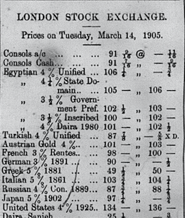
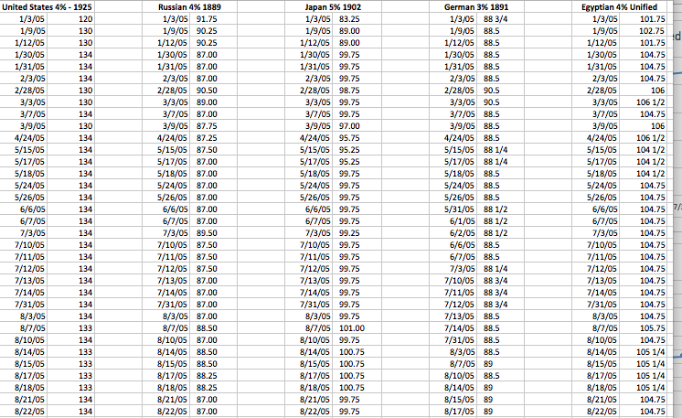
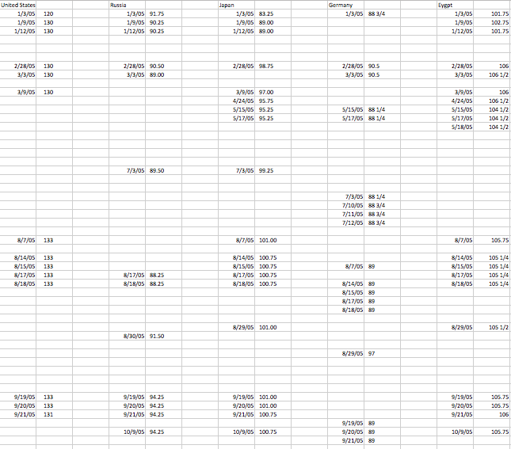
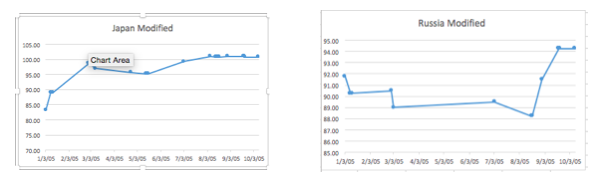
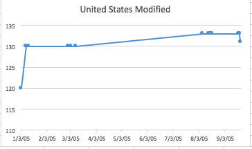
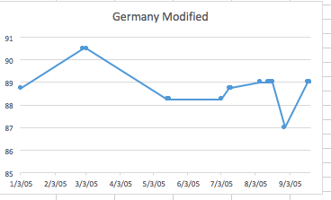

During the time in which the Egyptian Gazette was being produced in Alexandria, the world was dramatically different compared to today. Lifestyles and occupations in Egypt, along with the rest of the world had changed. However, basic human behaviors rarely change, including our desire for money. Among the highest paying professions in the past few centuries have been banking and investing. Modern investing and stock trading traces it’s roots to European investing, which has existed in one form or another for over 600 years. Currently, computers and robots make billions of exchanges automatically every single day while updating employees of investing firms, large and small, in real time. Most trading is done on the New York Stock Exchange, the largest in the history of the world. Following World Wars One and Two, the United States took over a majority of stock and bond exchanges. Thanks to massive infrastructure investments that allowed American traders to reach clients across the world via telephone and eventually the internet and it’s satellite network. However, before the United States became the super power for banking and trading, major countries (typically those with expansive colonial empires) set up stock exchanges in their capital cities that allowed citizens and firms to trade locally.

Images Courtesy of Investopedia.com

It was then, about 200 years ago, that the London Stock Exchange was created. It only served clients locally as no reliable and quick long distance communication network existed yet. However, this changed with the invention of the telegraph, and the subsequent installation of massive, government funded underground and undersea telegraph networks that connected colonial empires with their own territories and with each other. At the stock exchanges, firms and governments were now able to serve clients in all their colonies and across the world, thanks to communication exchanges that took minutes to send and receive rather than weeks.

Newspapers were the worldwide medium for reporting prices of stocks and bonds, and the story was no different in the British empire, including Egypt. In the Egyptian Gazette, stock and bond prices were reported daily to investors and firms who had assets around the world. It was this around this time that modern trading first began to develop. But, in comparison to today’s markets, stocks and bonds were far less diverse. Most exchanges dealt with import and export markets and government issued bonds (and, in more complexity, the futures of those). Additionally, stocks and bonds in the 1900s were far less volatile. Changes were observed over weeks and months in newspapers and were usually only dramatically affected by global events like conflicts and wars or major political events. Another major difference was a lack of reliable indices, like the Dow Jones and S&P 500, that normal citizens could read and get an accurate idea of the general conditions of the market. Instead of an index, most people observed bond prices of major countries to get an overall idea of the other regional markets. United States bond prices gave a good idea of how well the New York Stock Exchange was doing, Germany and France for markets in Berlin and Paris, Japan for Tokyo and so on.

These prices were reported by each of the major exchanges across the world to show the conditions of world markets. On almost every page 4 of the Egyptian Gazette, bond prices from around the world were reported. Each with the prices and type of bond listed in order. The format, as with most papers across the world, was to state the country who issued it, the interest rate when first purchased and the selling year. Selling year is the year in which the bonds were eligible to be sold and interest rates were the rate of return at the time it was purchased. 	

Although information regarding the exact selling years and interest rates in this period of time is scarce, the interest rates and selling years serve to identify the type of bond, as only commonly purchased ones were reported in the paper. The information that is important is are the prices reported with the bonds, and how they change over the course of the paper. In order to analyze the price changes, I ran x-path queries for five different bonds from important economies all around the world during the early 20th century. The five I selected were the United States, Germany, Russia, Japan and Egypt. Egypt was a selected as a standard for other countries. The goal of this investigation was determine if major events around the world affected the bond prices, indicators of overall market conditions, and to what extent.

I began by running 5 X-path queries on stock exchange sections of the entire contents of the Digital Egyptian Gazette. Each X-path followed the same template: //table//cell[contains(.,’Augment.’)]/following-sibling::cell[1]/string(). To locate each bond within the newspaper, I replaced the term ‘Augment’ with the name of the bond (i.e United States 4% 1925) for all the countries. For each query, I received around 70 results of prices, which I then cleaned up in Atom and transferred to Excel

After removing typos and unmodified template results, I graphed the remaining data. It had far fewer points than original results but was much more accurate.

The next major step in research was to investigate historical events and see if and how they affected bond prices. One of the most frequently mentioned events in the Egyptian Gazette was the Russo-Japanese war. According the United States Office of the Historian (https://history.state.gov/milestones/1899-1913/portsmouth-treaty) Russia, having recently completed the Trans-Siberian Railroad, sought to permanently settle and dominate the far eastern reaches of its claimed land, the Korean Peninsula and Manchuria, which were occupied at the time by the Japanese. Beginning in February 1904, the Russians and Japanese engaged in several deadly battles, losing hundreds of thousands of men on each side. The war concluded on land in early March 1905 and on the Sea in early May, with decisive Japanese victories in each. This win for the Japanese and loss for the Russians reflected, quite obviously, in the prices of the bonds.

The sharp increase in bond prices following the Japanese win and sharp decrease in bond prices in Russia right around the time of the big land victory (late February, early March) support the hypothesis that major events affect the prices.

The United States had major historical event in the beginning of 1905 when Theodore Roosevelt was sworn in for his first term in 1905. Public support and confidence in the newly elected president was reflected in the bond prices, to a major change of 10 points within the week that he was inaugurated. This increase, however, is fairly common, according to marketwatch.com (http://www.marketwatch.com/story/heres-how-the-stock-market-performs-from-election-day-through-inauguration-day-2016-11-08). With a few notable exceptions, American markets typically improve when a new President is elected and sworn in, displaying optimism in the economy and government. MarketWatch’s data has show about a 7-8% increase, on average, as a reaction to the presidency changing office.

The next foreign market analysis was Germany. As there wasn’t much information in the Egyptian Gazette regarding the happenings of mainland Germany or it’s colonies, further research had to be taken. Despite the growing tension between European power leading up to World War I, there was only one major conflict that happened involving Germany over the calendar year of 1905; the First Moroccan Crisis, or Tangier Crisis (as known to some). In March 1905, Kaiser Wilhelm II of Germany visited Tangier and declared his support for Sultan Abdelaziz of Morocco and his nation’s sovereignty. This angered neighbors France and the United Kingdom, who both recognized Morocco as French territory. The crisis dramatically strained relations between Germany, France and the U.K. and was, according to historians published in the Journal of Modern History (http://www.jstor.org/stable/1872165), a major event that was a cause for the First World War. According the graph of bond prices, the crisis is adequately reflected. The most dramatic change in the graph is between March and May, corresponding to Wilhelm visit which took place from the end of March to the beginning of April.

The Egyptian graph was not as clear as the previous four countries. Sporadic and relatively small changes are shown throughout the course of the year. In comparison to the other major colonial empires, the events in Egypt are insignificant. From time period 1900 to the beginning of World War I was the peak of the British Empire, in terms of economic success and total colonial land. An overall positive trend can be observed in the price the Egyptian unified bonds. This is most likely due to the prosperity that the British empire was enjoying at the time. The smaller changes in the graph are possibly due to smaller events in Egypt or back in Great Britain. The smaller changes could possibly be discovered by analyzing the entire newspaper and looking for local events that could affect Egypt’s financial situation, but that kind of analysis is out of scope of this particular research.

Considering all of the data, it is easy to assume that these events are completely caused by the events happening in each of the specific countries. However, correlation does not always mean causation and, therefore, I would not be content in confirming the previous assumption. Although the graphs do significantly change on dates of global events, the degree of the changes is also important to observe. Some countries may have more volatile economies whereas others are more steady (i.e. a three point change in one country may not be as significant as a three point change in another). Additionally, countless factors can affect global economics. Changes may be due to financial trends or actions that may not have been reported over 100 years ago, and researchers could possibly never know the answer, as data is not nearly as precise and abundant as it is today. In conclusion, it was fascinating to observe how markets changed in corresponding time frames to major global events. This research was successful in that it alluded to the real possibility that these events caused major market changes. Determining exact causation is not possible given data from a single newspaper in one colony, but observing the beginning of our modern global society was extremely interesting.
