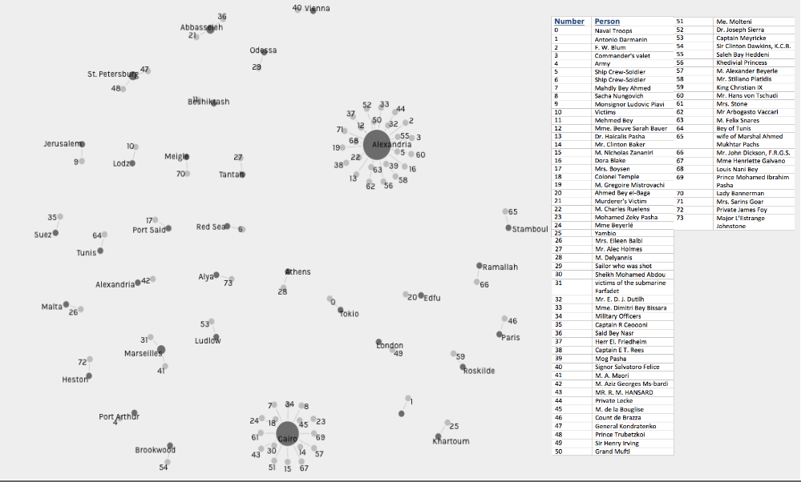

In the early 20th century, in Alexandria, Egypt, many people died, but not everyone had a funeral. Of the funerals reported by the Egyptian Gazette, it turns out that not all of the funerals reported even took place in Alexandria. I am interested in why some people were lucky enough to have a funeral and why some funerals were mentioned in the newspaper even if it didn’t happen in Alexandria?

My original idea for this analysis was to just find out where most of these funerals were taking place. I wanted to see where they were being held to see if this could show if the Egyptian Gazette more focused on local events or foreign events. Soon after starting my research, my goal morphed into finding out not only where these funerals took place, but also whom these funerals were for. My question changed to include who the people are because I wanted to see if there was a certain “type” of person who had a funeral. So my goal in the end of this was to see if there was clearly a more common location for funerals and a specific type of person who had a funeral in 1905 and 1906 as reported by the Egyptian Gazette.

I started my research by using the XPath Query ``//div/p[contain(., “funeral”)]`` to find all of the instances where the word “funeral” appears in the newspaper. The query brought up 121 results. I found that the easiest way to record my results would be to read through each one of these results to find which ones are actual funeral announcements and then I could record the name of the person and place of the funeral. After reading through each search result I realized that a few of the more popular funerals were reported on a couple of different times (before and after the actual funeral). Also, quite a few results weren’t actually funeral announcements and were actually articles about architecture, explaining that some buildings look like “funeral temples” or reporting on artifacts found that would be used in a funeral. Other times the word “funeral” was mentioned they were expense reports that stated how much the country either budgeted or spent on everything, including funeral expenses. Out of the 121 results, only 74 of these results were actually original funeral announcements.

After I found all of the funerals that were reported in the Egyptian Gazette, I decided to perform the XPath Query ``//div/p[contains(., ‘died’)]`` to find the number of times the newspaper reported a death. I wanted to see if the number of people who had funerals was the same as the number of people who had died. This significant difference in numbers can help prove that only certain people are having their funerals reported in the Egyptian Gazette. From this query, I got 337 results, but when I read through all of the results, I found that the newspaper actually reported 406 deaths.

There was a large amount of deaths reported by the Egyptian Gazette in 1905 and 1906, but only a small amount of funerals reported in the newspaper. Out of the 406 deaths reported in the Egyptian Gazette, only 74 funerals were reported, which means only about 18% of the people who died actually had their funeral reported. The deaths that were reported included articles that recorded groups of anonymous people dying, such as multiple soldiers who died in a military accident, or multiple people dying from the plague at around the same time. While when the funerals were reported, they reported on only one person at a time and named them specifically. Most of the funerals that were reported gave at least a sentence or two describing their lives and all of the people seemed to be somewhat well known people in Alexandria (or a family member of a well known person). An example of the death and funeral of a very important person in Alexandria is Dr. Haicalis Pasha, the “’Editor-proprietor’ of the ‘Phare d’Alexandrie’”. Dr. Pasha’s death and funeral was reported on three days in a row. His original death announcement labeled him as the “’doyen’ of the Egyptian Press,” as well as named him as “his Excellency Dr. Haicalis Pasha.” It’s very clear that Dr. Pasha was very important in Alexandria, at least to the writers at the Egyptian Gazette. It may seem like the person who wrote his obituary is a little biased towards Dr. Pasha because he wrote for the Egyptian Gazette before he died, but it seems as though he actually was a very important person in Alexandria because his funeral procession was headed by the police and famous people, such as Hafez Mohamed Bey, Sub-Governor of Alexandria, came to show their respects at his funeral. It seems like most of the people who had funeral announcements in the Egyptian Gazette were well known because of the job that they had, which can lead us to believe that these people were probably wealthier than some of the other people who died, which means that they are able to afford a funeral, while others cannot afford one in the first place. So one can conclude that well known, wealthy people had funerals in Alexandria in 1905 and 1906.

While most of the funerals reported in the Egyptian Gazette did occur in Alexandria, not all did, in fact, a large amount of the funerals did not even take place in Egypt. 34% of the funerals reported in the Egyptian Gazette occurred in Alexandria, 22% of the funerals took place in Cairo, 6% of funerals took place in Egypt outside of Alexandria and Cairo, and 38% of funerals occurred outside of Egypt all together. This means that 62% of funerals reported in the Egyptian Gazette occurred in Egypt. The fact that the Egyptian Gazette is reporting on funerals mostly within the country and that Alexandria is the individual city with the highest percentage of funerals reported, shows that the Egyptian Gazette is in fact focused more on local events, rather than international events. But why is the Egyptian Gazette even interested in the funerals that took place outside if Egypt? Most of the international funerals had one thing in common, they were for someone who was famous in some way, whether if they were some form of royalty or if they were a famous celebrity. For example, on October 28, 1905, Sir Henry Irving, a very famous actor had a large funeral in London, England. Because of his level of fame, I can only imagine that his funeral was not only reported in the Egyptian Gazette, but every major or even minor newspaper in the world probably reported on his funeral. While most of the international funerals were for royal or famous people, the ones that weren’t were usually well known citizens of Alexandria, or another Egyptian city, who died while they were on vacation out of the country. So it can be said that the Egyptian Gazette mainly reported these international funerals if the deceased was either a well known celebrities or well known Egyptians who just happened to die outside of Egypt.

This word cloud connects all the people who had funerals in a specific city. I chose this visualization to show the location where the most funerals reported by the Egyptian Gazette occurred. I had the option between showing the names of the deceased on the word cloud and just showing the number that their name is associated with on a table. At first I was going to use the chart that showed the names of the deceased because I wanted to show who was actually having these funerals, rather than just showing a number that essentially meant nothing, but I also found that having the names on the chart made it quite cluttered and it was actually very difficult to read the names this way. So I had to find a way to make it so that the chart was readable, but the people reading this could see the names of the people who had funerals. My solution to this problem was to make the chart without the names on it and just have the generated numbers shown on the graph that coordinate with the name on the key that I attached to the chart. For example, the number “19” on the chart that is connected to Alexandria will correspond to the name “M. Gregoire Mistrovachi” on the key, meaning that M. Gregoire Mistrovachi had his funeral in Alexandria. This approach makes the chart look clean and put together, but also shows the name who had the funeral and where the funeral took place in Egypt in 1905 and 1906.

One of the major limitations I had during this analysis was not knowing if the funerals that the Egyptian Gazette reported were the only funerals happening in Alexandria in 1905 and 1906. I know that the few international funerals and Egyptian funerals outside of Alexandria that were reported are not the only international funerals that happened in 1905 and 1906 because most of the funerals happening all over the world aren’t relevant to the readers of the Egyptian Gazette. But even though there were many more funerals reported in Alexandria than any other city, the newspaper could still have left some out because the writers didn’t think some of the people were important enough, or maybe some families wanted a private funeral and didn’t want the newspaper to publish a formal announcement for the funeral. Either way, there is a good chance that more funerals occurred in Alexandria than just the ones that were reported in the Egyptian Gazette.
