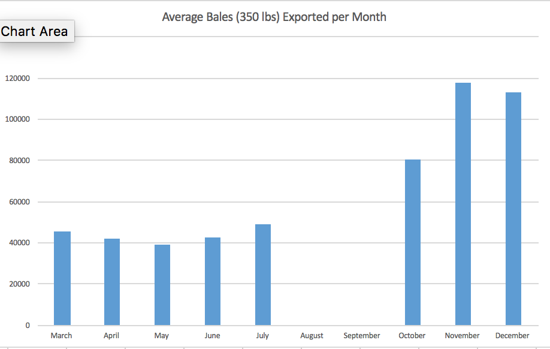
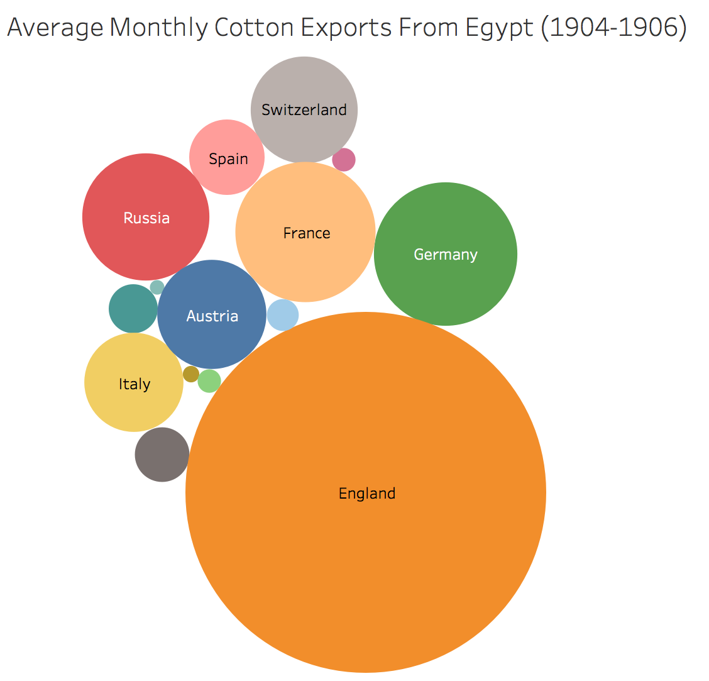

# Developing Standards

Cotton was a main staple of the Egyptian economy during the early 20th century. British control in Egypt lead to the exploitation of the cotton crop. The 1832 defeat of Egyptian leader, Muhammed Ali, lead to British control in Egypt. The American Civil War left British cotton supplies running low, leading to a growing interest in the Egypt’s agriculture. Egyptian cotton was referred to as “white gold” (Hidji, 2016). The crop was deemed as a “consistent earner”, thus, leading to British investment (The British Empire, n.d.).  Today, cotton remains a main staple in Egypt, providing economic prosperity in the public sector. When cotton production slows, so does the Egyptian economy. Understanding trends in cotton production is essential to the maintenance of Egypt’s economic well-being. The collection of data, regarding Egyptian cotton production makes trends in production visible and easily recognized. Seeing that some years offered greater yields than others can lead to a multitude of questions such as; what factors contribute to high levels of cotton production? What factors detract from cotton production? Answering these questions will lead to a better understanding of factors that contribute cotton production.

Recent fluctuations in cotton production have drawn attention from Egyptian citizens. 2013-2014 exports totaled 12.5 million pounds of cotton, 2014-2015 saw a rise in production to 24.4 million. However, from 2015-2016 all gains receded. With cotton having significant monetary impact on Egypt it is important to discover the cause of these fluctuations. An appropriate way to answer this question would be through the collection of relevant data. Some of the best literature to use when doing so includes; old newspapers and government records. The particular sources I gathered data from are; Cotton Production In Egypt and, The Egyptian Gazette. Cotton Production in Egypt is a government resource from the United states, Bureau of Agricultural Economics. This source mainly depicted Agricultural influences on cotton growth, such as temperature and humidity. The Egyptian Gazette is a British newspaper produced in Cairo, while Egypt was under British rule. The years I studied in it range from 1905-1906. My main goal with using the Egyptian Gazette was to find local problems that may have influenced cotton production. The newspaper had many tables indicating cotton exports and pricing.  In using both of these sources I hoped that the past may offer some suggestions to the future of cotton production.

My search for information regarding cotton production was done mostly in the Egyptian Gazette. My classmates and I in IFS 2116, at Florida State University, are currently digitizing the newspaper. The aim of digitizing this newspaper is to make the documents easily accessible and to enable search functions within it. Doing so will make The Egyptian Gazette a source that can be easily accessed, providing relevant historical contexts and statistical information. The Egyptian Gazette is a credible source offering unbiased data regarding the production and exportation of cotton. As previously mentioned, digitizing the newspaper allows for its contents to be fully searchable. Its translation into markup language was essential to my discoveries of this statistical information; aiding my ability to find relevant information, thus limiting my research time.

Through my exploration of The Egyptian Gazette I found similarities in the newspapers formatting. There was up to 8 pages in a daily issue of The Egyptian Gazette. The first couple pages are mostly ads, with articles starting in the last column of page two. Articles resume on page 3. Pages 4 through 7 carried the bulk of my information used. In the midst of those page I came across a table titled, “COTON”. The purpose of the table was to display exportation totals for each month of the year. As I was digitizing my week of the Egyptian Gazette it was one of the ads that frequently appeared. Not only did it display the total cotton exports but it also showed what country they were exported to.

The table that held the export data had a specific XML ID. Performing an Xpath Query made my results very specific: //div[@xml:id="deg-el-cotn01”]. I found 37 items in the XML project file. The results displayed a distinct pattern in the data. There were 117,812 bales of Cotton exported in November 1905, however, there were 39,384 bales exported in May 1906. I wondered what could be the cause of the vast difference in monthly totals. Upon revision of my secondary sources, I found an explanation for these disparities. The planting of cotton takes place from February through April. The growth of cotton starts in April and goes through the October. November is the month that they harvest the cotton (Norris, 1934).

Furthermore, I noticed that the cotton exports were recorded in units called “Balles”, which is French for bales. I was curious what this unit of measurement stood for in terms of size. The National Cotton Council of America indicated that today’s standard weight for a bale of cotton is 500 pounds. I began to wonder if this may have been different during the early 20th century. I searched for change in the measurement of cotton bales. Through further research I came across the 1919 American Wool and Cotton Reporter. This edition of the American Wool and Cotton Reporter Indicated that the standard weight of a bale of cotton in 1919 was 350-400 pounds. The article further indicated that the standards were in fluctuation during this time period and serious measures were being taken to refine the practice of cotton bailing (American Wool and Cotton Reporter, 1919).

Another thing that the data represents is the relations between Egypt and other countries. As I stated previously, Egypt was under British rule in the early 20th century. The data indicates England’s exploitation of the cotton crop in Egypt. Cotton export data displays evidence of the different countries relationship with England. This data becomes even more important considering that World War I is only ten years after this data was collected. Collecting this data and creating an understandable visualization of such can provide better context to factors that lead to World War I.

As I continued to search through my secondary sources I found more information regarding cotton exports. On page 20 of Cotton Production in Egypt , a table depicting cotton acreage from 1911-1931. The graph showed an increase of acreage for cotton production nearly every year for twenty years. This was surely a prosperous time for cotton production during those years. This only makes the concern for modern day cotton production even more relevant. The answer to this problem is not an easy one to answer. There are a lot of factors which could contribute to the manifestation of cotton. Such as temperature, humidity, natural selection and other biological factors. The head of Egypt’s Farmers Union, Farid Wasil attributes a decrease in cotton exports is due to the public sector equipping their textile factories with machines that are incapable of processing long-staple cotton. This has led to a decrease in sales of cotton.

A greater data bank was something that would have aided my research. to generate through the class XML files. The importation of these documents takes time. One must approach the digitization of this newspaper with a high level of meticulousness. The data generated from the XML was limited by the number of uploads and table edits. This problem also has to do with OCR software. The OCR software used to create XML is efficient, but not entirely effective. While it is better than re-typing the contents by hand, the amount of editing required after OCR is still great. I believe as software and the ease of digitizing physical documents improves, input will follow suit.

That being said, I think this was a valuable research project to undertake. I learned about trends in cotton production and discovered several factors that contribute to its growth. Most importantly I found information which aide in the interpretation of data sets. Understanding how standard measurements develop provides clarity to variations in cotton production. While knowing how standards change is significant it did not provide any clarity to the recent receding in cotton production.  The data I extracted fails to support any long term conclusions on cotton production.

Research to improve cotton exportation is ongoing. As I continue to re-approach evaluating cotton exports it is important to keep in mind that the standard weight of a cotton bale has changed which is important to factor in when interpreting data. Gathering more information about cotton production will hopefully lead to a more consistent grow season in Egypt as well as an understanding of relations between foreign countries. As research continues, so does the input of the digital Egyptian Gazette. The addition of more editions will lead to greater availability of the documents and easier access to the data they provide. Conducting this research project required a great deal of patience and attention. It took many hours to generate a worthwhile question. Finding data to ask that question took even longer. I would say that having the XML ID of the cotton export table was a key factor to gathering data for my research project. The XPath Query I performed was very efficient in generating relevant data. I found my research shift gears when I couldn’t find enough material for my initial serial question. The more I did research the more it shaped the question I was trying to address. Information can not only provide answers to the questions you are trying to ask, but also the lead to the questions that will hopefully further your understanding. A digital version of the Egyptian Gazette will undoubtedly contribute the inquiry of relevant knowledge.

## Work Cited

American Wool and Cotton Reporter. (1919). Notes and Queries. American Wool and Cotton Reporter, 46.

Hidji, A. (2016, June 24). Pulse of Egypt. Retrieved from Egypt pulse : http://www.al-monitor.com/pulse/originals/2016/06/egypt-cotton-production-decline-agriculture-crops.html

Norris, P. (1934). COTTON PRODUCTION IN EGYPT. BUREAU OF AGRICULTURAL ECONOMICS, 1-43.

The British Empire. (n.d.). The British Empire. Retrieved from Egypt: http://www.britishempire.co.uk/maproom/egypt.htm
