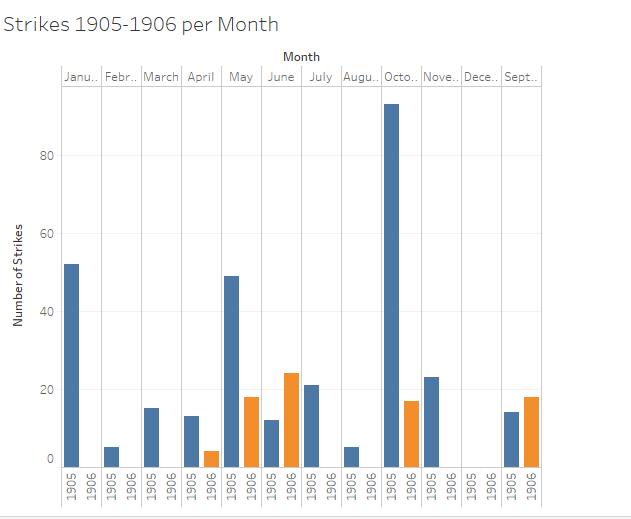

# The Domino Effect

# #  The Impact of Strikes

# # # 1905-1906

# # # # Author: Jasmine Johnson Date:2017-05-04

![Strike in Pas-de-Calais (1906)]
(http://www.wikiwand.com/en/Strike_action)

The *Egyptian Gazette* sporadically provides abstract accounts of  various 20th century strikes.  In particular, the infamous Khedivial Cairo Law School strike led by graduate students was mentioned in just two issues and discontinued. Conversely other strikes were continuously reported from various sites outside of Cairo, Egypt . Points of inquiry then developed as to how often was the grievances of the Egyptian education system voiced in the *Egyptian Gazette* as opposed to these other strikes and what relationship, if any, might these outside strikes relate to the essence of Egypt.  In order to resolve these curiosities, several queries were executed to determine the relevance, dynamics and parallelism of these  movements.

The foremost query that was ran merely revolved around the word “strike.” This query was ran in the preliminary round of research and resulted in just 63 items, majority of which were articles written in 1905.  At this point in time the content repository had hardly been updated which led to the minimal return of usable information. Nonetheless this preliminary query offered a starting point as I was able to skim through the items to identify the categories of strikes that were often reported in mostly in 1905 and some of 1906; the foremost category being strikes relating to labor, the police, and foreign powers, as well as the one example pertaining to the law school.

This query certainly posed a few challenges. One being that in some cases, I found that articles may have contained the misspelled versions of the word “strike” due to the lack of the utilization of OCR in some issues. Thus, the use of that query may not have included articles that presented another useful instance. Moreover, the word “strike” was often used out of context of my research, by the definition of “to come to mind unexpectedly” rather than “to protest”. For instance one article mentioned how a  school curriculum may “strike” the attention of boys. This exception however was relieved by the fact that there were so little results in the initial query; reading through each item it was easy to disregard that information. Then again, when the content repository was  later updated and the query was ran again, yielding more results, identifying these miscellaneous uses of the word “strike” was not as easy to distinguish.

_**Actual**_ _**Queries**__
“//div[@type="section"]/div/p[contains(., 'strike')]”

“//div[@type="section"]/div/p[contains(., 'strike')]//dateline”

“//div[@type="section"]/div/p[contains(., 'strike')]//placename”
               

In order to return more applicable results, I then developed my query to include, the words “strike” and “dateline” as well as “strike” and “place name.” With the results of these queries, I was able to determine, what time of year did most strikes occur, as well as what were the major locations in which these strikes took place.

The prominent months in which strikes occurred were _November_, _ May_, _October_, and _January_, with  the former being the highest. Additionally the top locations in which strikes had  occurred included _London, _St. Petersburg_, and _Paris_.

In 1905 the Russian Revolution,  a time  which provoked  hundreds of thousands of workers to resist, began and was the centripetal for labor strikes.  According to , The strikes really escalated the last 4 months of 1905, beginning in September with the  protest against the wages, and hours in the printing industry. This could possibly be an explanation as to why the queries yielded the a great number of results for September 1905 through October 1905. In addition, the Russian  city, St. Petersburg yielded several results from this query which is understandable considering that it is the “primacy of the national economy...holding a seat of government.” In order for wages to truly change, or for universal suffrage rights to be upheld  protesters most likely  would have led strikes in St. Petersburg to be a direct link to reform that would be executed by the Russian Government.

Moreover in the months of October and November, witnessed formation of several labor unions, probably explaining the increase in yielded results for the word “Strike” among these two months. The question then becomes, why are the strikes in Russia relevant or newsworthy to the readers of the *Egyptian Gazette*? Egypt had amicable ties to Russia, which was exemplified by the construction of the Egyptian Bridge in January 1905.  The success of the union strikes in Russia would more than likely yield hope for the union movements coexisting in Egypt.

Two other cities that also returned several results from the query were the British city of London, England (United Kingdom) and the French city of Paris, France. It is not a surprise that these two cities in addition to Rome, and Warsaw, cities  yielded the second highest results, because these are all territories of the dominating European powers; Particularly the French, Germans, and the British. During this time period, these major European powers were somewhat competing for control of Egyptian territory particularly for control over the Suez Canal, which was a mechanism that allowed for trade and productivity to continue.

According, Hodgson Pratt, a British pacifist, Great Britain wanted peace whereas the French were irritated with British presence in Egypt.! [The Advocate for Peace](http://www.jstor.org/stable/20665297) As the context of the *Egyptian Gazette* is revealed, the British- favoring undertone and is becoming more evident, as there are rarely, any conflicts stemming from  the British presence in Egypt mentioned in  the newspaper, however several highlighted cases of French disturbances.  In fact, the law school strike was sparked by the dissemination of ideals established by the influence of the French presence in Cairo. It is safe to say the a great deal of strikes were a retaliation of to the negative impacts that came with the “sphere of influence.”

The majority of the strikes that occurred throughout the 1905-1906 era were most geared towards creating better working conditions and pay for industrial jobs, including mining, factory work and railway labor. These jobs tended to encounter the most dangers and yet were originally were not made up for by higher pay. Often times the frustration of such injustices led to violent malice-intended strikes. For instance, on August 2nd 1905 ![Unrest in Russia] (1905-08-02-p3.jpg), a strike near warsaw reported two strikers killed as the police counteracted movements.![Unrest in Russia] (1905-08-02-p3.jpg ) Moreover as mentioned in July 1905! [Distress In Russia. Owing To The Strikes] (1905-07-29-p3.jpg)]article strikers were “distressed” , fired from their places of work and  left to sleep in the open.  Many strikers tended to become targets for  incarcerations as they were partook in  thefts of stores to retrieve arsenals. ![Disturbances In Russia  Revolutionary Organization Discovered] (1905-03-20-p3.jpg). Interesting enough however, many of the strikes that are reported in the *Egyptian Gazette* did not actually occur in Egypt, but in the sites of major cities in the countries that make the great European Powers.

Arguably, However the labor strikes and labor units were an influential component towards the start strikes for the Law School in Cairo. The First official appearance of the Cairo Law School strike was on Wednesday, February 27th 1906  There is a great comparison that can be drawn between the strife of the labor strikers and the student strikers, which may lead one to believe that the graduate students were mimicking these labor unions but for their own cause. For instance, just as the laborers in factories, mines, and railways stopped showing up to work, students alike began to miss their professors lectures, which as in the former’s case led to harsh consequences. While labourers were often refused to be to rehired, or return to work, students were prohibited from entering examinations, which were necessary in order to obtain credit for courses. Unlike labor unions however, this retaliation merely led to another strike whereas labor unions, broke out in violence in theft when faced with more opposition from authorities.

Similarly, just as government officials and employers would give labor unions the floor to voice their concerns the Ministry of Public Instruction afforded the striking students the mobility to express their concerns . For instance, the law students wanted the freedom to leave and enter campus as they pleased rather than under the jurisdiction of the school. In perspective of modern-day higher education institutions, being denied this right, which today is so common-place would validly lead to some sort of resentment and uproar towards higher officials.

When the list of grievances were not answered, and the Ministry of Public Instruction issued an ultimatum for the protesting students, the students pushed for their cause towards the brink of the closure of their law school. The motivation to continue advocating for these rights can arguably be inspired by the similar persistence that labor unions possessed until wages were raised and work conditions were improved; and the fact that the demands of the labor unions were met especially might have given the law students the confidence that their campaign would also lead to change. By March 12, 1906, the students were ready to strike once more, however this time the author of the article realized a possible outside political advocacy motive for these school strikes. This would suggest that the Cairo Law School Students were not satisfied with the British government officials in power.

![ Muṣṭafā Kāmil, Egyptian politician] (https://www.britannica.com/biography/Mustafa-Kamil)
![Mustafa Kamil Pasha] (https://en.wikipedia.org/wiki/Mustafa_Kamil_Pasha)

_*“"If I weren't an Egyptian, I would have wished to be an Egyptian."*_
Mustafa Kamil Pasha,
Lawyer at the French law school in Cairo

The voice of  desired freedoms that  strikers in St. Petersburg  vocalized but were not later heard led to support of others strikers in different locations: Paris, and Warsaw. Thus the mindsets that  strikes in general  sparks one of striving to obtain something that individuals feel that they deserve or have the right of, became widespread. Later, Medical students and Polytechnic Students stood with the law school students  in their movement. The movement then grew, comparably to which labor rights were emphasized in more areas.

Initially, it seemed as though the writers of the *Egyptian Gazette* did not consider the school system a newsworthy topic as compared to the Russian Revolution as well as other conflicts occurring in French cities. However, it is evident that 1905-1906 was not the only miniscule era in which the school strikes were enacted but yet the very beginning to other declarations for higher education according to outside sources. Due to this fact, many sources regarding Cairo, Egypt during the early twentieth century were post 1905-1906, when more historical events began to take place. This was somewhat of an issue, as I sought to find a general understanding of Cairo, Egypt in regards to strikes, but was unsuccessful.

Nonetheless, the *Egyptian Gazette* and the information that was extractable, helped to draw the conclusion that strikes are a very important part of history, often neglected. Even the minor strikes, can lead to spreading awareness of issues which create movements and widespread advocacy. In addition these miniscule strikes, and the successes of them are often the precursor to many future movements serving as an encouraging inspiration for change and hope for evolution.

Further improvements could be made to develop this analysis by examining the Egyptian Gazette in later years. Perhaps getting a glimpse shortly after 1906 as well as in the mid 20th century will provide a more extensive look at the actual eruption of the several strikes thereafter due to the influence of surrounding nations' movements.

# # Works Cited

"Strike action." Wikiwand. N.p., n.d. Web. 05 May 2017. <http://www.wikiwand.com/en/Strike_action>.

Mustafa Kamil Pasha." Wikipedia. Wikimedia Foundation, 04 May 2017. Web. 05 May 2017. <https://en.wikipedia.org/wiki/Mustafa_Kamil_Pasha>.

“Front Matter.” The Advocate of Peace (1894-1920), vol. 57, no. 5, 1895, www.jstor.org/stable/20665294.

Smith, S. A. JStor.com. Taylor & Francis, Ltd. , n.d. Web. 5 May 2017. <(http://www.jstor.org/stable/151392)>. Vol. 36, No. 2 (Apr., 1984), pp. 282-289
