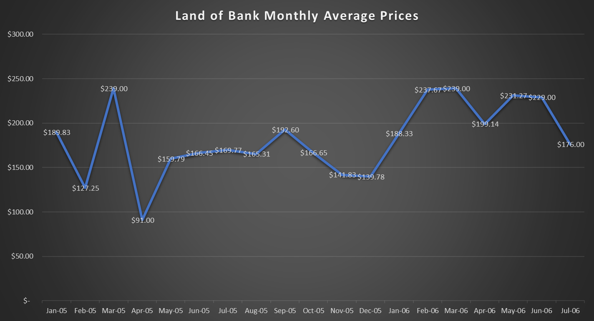

My goal throughout my research in The Egyptian Gazette was see if there was a way to determine when there were ups and downs in the economy during the years of 1905 and 1906. More importantly, my focus was primarily on the “Land Bank of Egypt” stocks and prices throughout these two years. I found it easier to study this specific bank because it had the most different and abundant data out of the other banks and stocks. I was hoping to encounter some significant highs or lows in these two years, and if I did find any I would dig deeper and find the cause of this fluctuation in the market.

First, to be able to come up with enough data to analyze the “Land Bank of Egypt” I created an xpath query that gave me sufficient information to be able to look through the prices in an organized fashion. After a couple of different queries attempts, there was finally one that brought me almost exactly where I needed to be. With this query,  ' ' ' ' ``//table//cell[contains(.,'Land Bank of Egypt')]/following-sibling::cell[1]/string()``, I was to come up with the a refined set of numbers that showed the prices of only “Land Bank of Egypt” in all the financial tables that came up in The Egyptian Gazette. Coming up with a proper query that gave me the correct information that I needed was probably the most difficult part of the data analyzation.

The next part of the process was to then clean up the data that I had come up with using the xpath query. Using atom, I had to clean up the data to be able to make table or graph out of the data I had collected. This step of the process was not the most difficult, but definitely was the most tedious. Trying to use regular expressions to help clean up my results was also very frustrating. After a while, and after trying many different methods I finally came up with data was ready to be inputted into a line chart, which I thought would best represent the data. I encountered the problem that there were many of the same price throughout the data, because this was on the templates we used. I decided to keep these prices in the data for now, until I can figure out if I am going to take out completely the template prices or keep them in the data.

Now that the data has been cleaned up and put into a chart anyone can see the fluctuations in prices throughout the years of 1905 and 1906. Instead of using Tableau I put in the dates and prices for the “Land Bank of Egypt” in excel because I am more familiar with it. In the prices column that I had created in excel, I put in a formula that found the minimum price from all the prices. It came back with the price of $8.00. This is how I was able to find where the price for the “Land Bank of Egypt” was the lowest. I plan on doing the same and inputting a formula that would give me the max of the prices but it seems that the template price is 239$ which is the maximum price. This skews my data significantly and I am not sure what I will do to get past this.

Since there were so many prices that were from the template or missing, I came up with an idea that would fix the graph that I had started off with. I was able to find the average of the prices for each month in excel. After doing this the graph was much more clean and was easier to read and understand. At this point now I had some good data to work with, which was relieving. Below is the graph that has the averages of the prices of each month of 1905 and most of 1906. Finding the averages was very helpful because it really took away the random ups and downs that I found before due to the template prices.

After some research, I was able to find some information as to why there were some changes in prices and how international banking came to Egypt. The Franco-British entete of 1904 stimulated the influx of foreign capital and the creation of new banks (Cameron). In 1905 French capital created the Land Bank of Egypt through the initiative of the Societe Marseillaise de Credit and banks from Alexandria, Marseille, and London. In the graph you can see the decrease towards the end of the year in 1906. This is thought to be because of the approaching financial crisis that came about in 1907. After the full force of the crisis had passed there were three banks that were established in succession by French capital. The bringing up of these institutions drove into bankruptcy their competitors. This is why you can see the steep decline in the average prices of The Land Bank of Egypt. There were, however some strong moments in the life of the Land Bank of Egypt. In the beginning months the bank had a nice peak, and then had a steady level throughout the year. This was when the foreign banking system was just beginning and showed that it had a strong market in Egypt. The Land Bank of Egypt did trade different currencies, but for the sake of keeping the graph readable I only chose data of the same currency. By trading different currencies the Land Bank of Egypt was a very healthy and strong financial institution in the years of 1905 and 1906.

Works Cited
_Cameron, Rondo, and V. I. Bovykin. International Banking, 1870-1914. New York: Oxford UP, 1992. Print._
