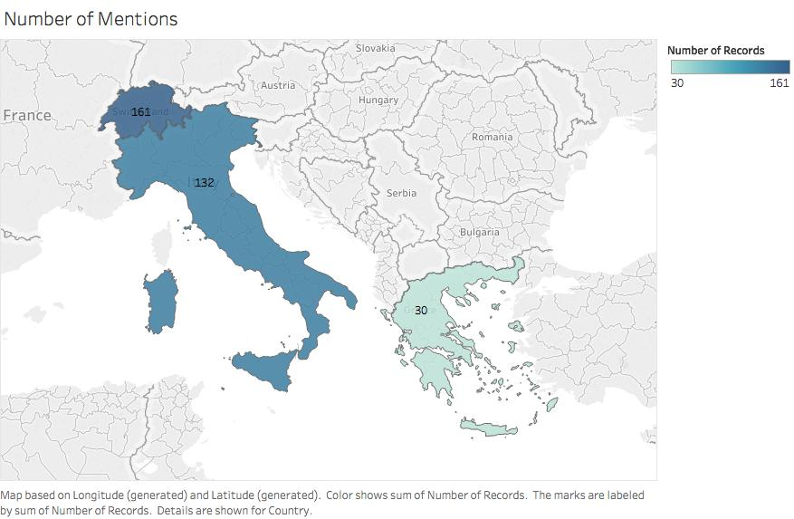
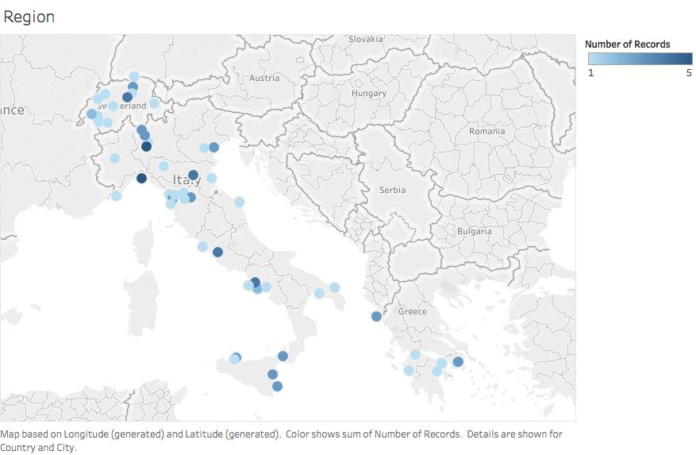
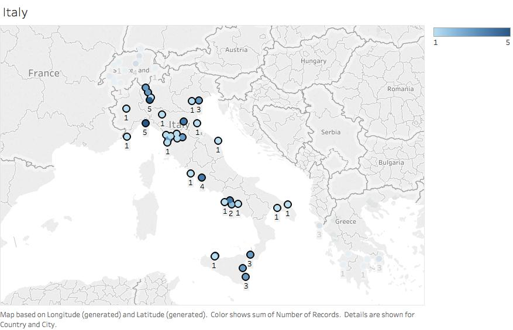
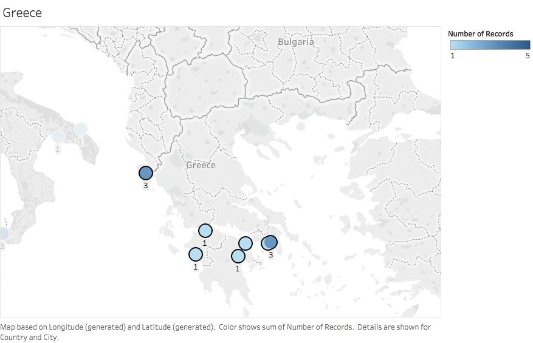
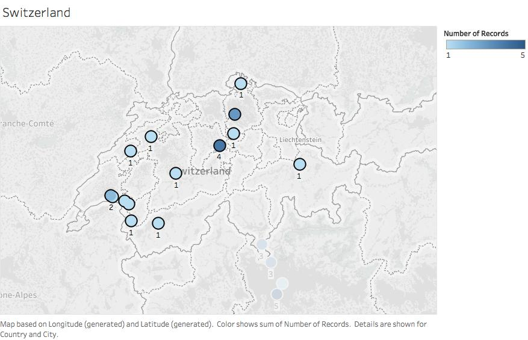

# Analysis of Vade Mecum for the Homeward Bound

Throughout the Egyptian Gazette there are many different types of pages that convey different information to the reader in the early twentieth century.  One page, the Vade Mecum for the Homeward Bound, is particularly interesting and gives travel recommendations for people leaving out of Alexandria, Egypt to travel all over the world.  The Vade Mecum for the Homeward bound varies throughout all of the editions and gives the reader different recommendations based on the time of year and when the issue was published.  I have picked three different issues from varios seasons of the year, and compared them to see what the author in Alexandria in the early 1900s thought the best areas were for Egyptians to travel.  The issues are from March 13, 15 and 17, 1905 (all the same two pages published throughout the entire week), December 5, 1905 and February 23, 1906.  Throughout the entire content fork of IFS2116 I was only able to find these three Vade Mecums.  There was one other one that was written in the comments "Vade Mecum for the Homeward bound, do not know how to format this," so this shows that there are more throughout the microfilm but not readily available to analyze in the class' XML documents.  They are also all in different formats, and I assume this is because the Egyptian Gazette offered more travel information at different times of the year for its subscribers.  For example, when people traveled more in summer there would be more extensive travel recommendations and detailed trips. While when people in Alexandria are less likely to travel it would be less useful, therefore only one page was published instead of two.

The process I chose to analyze these Vade Mecum for the Homeward Bound pages was to look at all of their travel suggestions and the page formatting.  I first realized that they ranged from being a single page to two pages, and this was based on the amount of recommendations the writer chose to do in that specific issue.  The Vade Mecum from the whole week of March 1905 was two pages, and I believe that this was because it was a peak travel time for Alexandrians, so the Egyptian Gazette had more destinations to suggest to travelers.

I used two different x-path queries to help me learn about the differences in the issues of Vade Mecum for the Homeward Bound.  Each of them helped me find something new, but at first I had to create one to help me actually find the other Vade Mecums within the IFS content fork.  I used:
count(//div[@xml:id="deg-el-vmhb01"]//div)
This helped me find the two other issues from February and December, as well as the other one that was not fully coded but acknowledged in the comments.
The other x-path query helped find the amount of divisions in the different Vade Mecum for the Homeward bound issues to learn about the different styles of formatting used by the Egyptian Gazette, and that query is:
count(//div/head[contains(.,'Vade')]/following-sibling::div)

The top x-path query helped me find the other issues of the Egyptian Gazette that contained a Vade Mecum page and the second one helped find the amount of divisions they contained.  The most common amount of divisions was 87.  I believe that this was because the template offered online for this page had 87 divisions and the students who encountered this page did not edit it to fit their specific issue.  I also encountered a problem with this because I typed out every detail of the March Vade Mecum but in my XML document only technically says it has 14 divisions when the query is returned.  This is because every other column in the Vade Mecum is filled with advertisements.  These advertisements are mainly for hotels in the recommended travel destinations.  Since there were so any ads and they were not available through the GitHub page when creating my XML document I had to put the names and their corresponding information into the comments, therefore not having a division like there should be after each one.  When it is put into the comments it does not count as a division, so this alters the information given by the query search in Oxygen.

In total, there were 323 mentions of specific destinations within three (Italy, Greece, and Switzerland) different countries.  These places ranged from cities, municipalities, and resorts, to mountains, springs, rivers, and islands.  The March issue was the most detailed and gave very specific travel information with 220 places mentioned throughout the three different countries.  The March issue also split Italy into a few different articles, which was unlike any of the other issues from December 1905 or February 1906.  It split the Italy travel guide into Southern Italy, Sicily, Central Italy, Northern Italy, and the Italian Lakes (Italian and French Riviera).  The entire first page of this issue was completely dedicated to travel throughout Italy.  It mentioned all the different sights that should be seen, and included the easiest and most efficient way to travel there (most likely by train – early 20th century travel). Within in these articles it also mentioned making stops in other countries like France and Switzerland.

Although the majority of the articles were about Italian travel, the most detailed travel plans came from the articles about Switzerland.  There were 161 different areas throughout Switzerland in the three different Vade Mecum issues.  In the articles about Switzerland they mention specific mountain ranges that you must see, lakes and glaciers that are spectacular, and even specific viewpoints that you can hike to.  The author mentions that places like Interlaken, Switzerland is great for people who love adventure, while travel to the Swiss Alps are great for people who love to be in the snow and lodges.  The writer also mentions many “health resorts” and specific amenities they offer for travelers.

Lastly, Greece and what were called the Ionian Isles were mentioned in all three different Vade Mecum for the Homeward Bounds.  One curiosity that intrigued me was in the December issue there were only a few sentences about travel to Greece.  Within those sentences they only mentioned Athens and Corfu were worth seeing.  This made me wonder if there was anything specifically happening in Greece during December of 1905, and their relationship with Alexandria or Egypt in general.  Greece was the least mentioned of all the destinations, and they focused on what used to be Constantinople.  This made it difficult to map specific locations, and it made it necessary to research the different cities and if they still existed and their modern names.

This is an image of the entire region that the Egyptian Gazette’s Vade Mecum recommends to travel to.  Notice the different darkness of all of the countries; Greece, Italy, and Switzerland.  The importance of this image is to see that although in the spreadsheet of all the places mentioned Greece was by far the highest, it is in fact severely the lowest in this visualization.  This is due to the fact that the article focused on Constantinople, and that is no longer is a country which made it difficult to find the modern versions of the places mentioned.  I found the modern city names for quite a few locations, but others are not recognized anymore.  They existed in early 20th century Greece, but now they are forgotten or considered “ancient cities.”

This is an image of the entire region that the Egyptian Gazette’s Vade Mecum recommends travelling to.  Notice the different darkness of the different countries, Greece, Italy, and Switzerland.  The importance of this image is to see that although in the spreadsheet of all the places mentioned Greece was by far the highest, it is in fact the lowest in this visualization.  This is due to the fact that the article focused on Constantinople and that no longer is a country.  I found the modern city names for quite a few locations, but others dare not recognized anymore.  They existed in early 20th century Greece, but now they are forgotten or considered “ancient cities.”

This visualization focuses on travel to Italy from the three different issues of the Vade Mecum for the Homeward Bound.  It helps show that the recognized locations were spread throughout Italy, but also were quite concentrated in Northern Italy.  There are locations that were mentioned five different times.  This shows that while the destination was most likely mentioned in the articles about Italy, it was also brought up in articles about other countries as a travel hub or stop over while on the road.

This visualization focuses on travel to Greece and the former Ionian Isles from the three different issues of the Vade Mecum for the Homeward Bound.  The main concentration of destinations is not on mainland Greece, but the islands off the southern coast.  These areas were most likely easier to travel too from Alexandria, Egypt.  They are also the few that are still recognized today because of Constantinople.

This visualization focuses on travel to Switzerland from the three different issues of the Vade Mecum for the Homeward Bound.  This is interesting because there are no places in Switzerland that are also on the border of Italy like they were mentioned to be in the articles.  This could be cause by changes in names or the places mentioned are not recognized as cities but only small destinations such as glaciers, mountains or possibly even viewpoints.  They are also concentrated in two specific areas because the resorts and mountain ranges are all connected, and therefore will show up very close to each other in the smallest of the three countries recommended to travel to in the Vade Mecum for the Homeward Bound.
