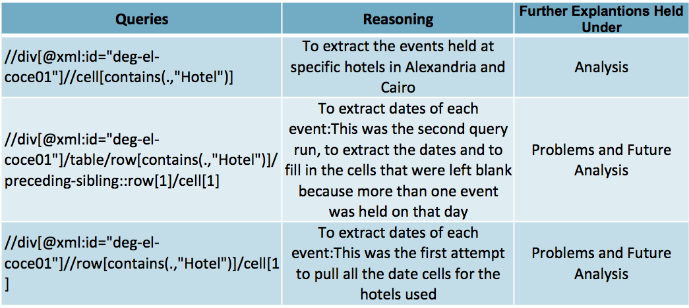
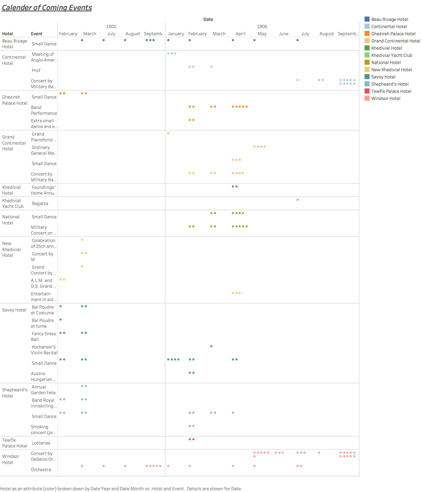

---
Introduction
---
The Egyptian Gazette is made up of a wide variety of information. If you were sit down and read it in one sitting, it would without a doubt be overwhelming. The week I was assigned for this class was February 19, 1906 through February 24, 1906. Uniquely, my week consisted of eight pages everyday unlike majority of the other weeks only comprised of six. The major difference noticed when briefly scanning through my week was that almost every page seven was a “Vade Mecum” page. Vade Mecum is a phrase that represents a handbook or a guide of important information. In the case of the Egyptian Gazette, the vade mecum page comprised of travel information ranging from shipping routes, to hotel advertisements, and important information regarding each location. The vade mecum pages only appear on a handful of days throughout the year, so to have it appear on five out of the six days of my week is absolutely questioning. It raised my curiosities as to what events occur that makes traveling so prominent around this time. The vade mecum pages all identical and if not, they are extremely similar, therefore observing that page would not provide me with enough information to conduct a grand serial analysis. Thus, I will be observing the Calendar of Coming Events. This portion of the Egyptian Gazette provides a list of events that will be taking place throughout the next couple months within various locations. The question I would like to pose is what events are occurring at hotels in Alexandria and Cairo through the Calendar of Coming Events, and how this plays a role in travel patterns via the Vade Mecum.

---
Background Information
---
This class called for the use of Microfilm. In order to obtain the information needed to conduct and perform this serial analysis, all students were instructed to go to the library to use the microfilm machines. The machine was called ScanPro 2000; which allowed us to take scans of each page of the week we were assigned from The Egyptian Gazette. This process alone was very time consuming because the actual films images were not very clean, and precise. Therefore, we had to take smaller clips of each page; within each clip you had to crop and make edits. It was a very tedious task getting the scroll wheel to stay in the exact you needed for the clip, focusing and adjusting the brightness to the perfect setting, and the list can go on and on for a while. All of this was necessary in order to get the clearest image to make the next step in the encoding process easier. The next step for the pages that did not have advertisements, such as page threes, was to run the clipped images through Cisdem OCR Wizard, a program that allows you to convert images into text word documents. OCR alone was a huge time saver so we did not have to write out all the text but it still came with a great deal of issues. Some of which included miss reading certain letters such as “c” and “o”, mistaking blotches in the images as exponent words, changing of fonts, sizes, and text boxes. As these steps were what we did majority of this semester, it truly was a lot of work and speaking on behalf of myself I am still working on this process.

---
Queries
---
In order to conduct my XPath query, I went to the how to tab located within our course website to piece together multiple queries to help narrow down my search results. A basic element used in all of my searches was the use of //div; this tells Oxygen to only search under the divs. From there, we have numerous routes to go down; based on the fact that my serial question deals with one specific “advertisement” I decided to search using the type and element settings. The following table consists of the actual queries and reasoning’s behind the use of each.
 

---
Procedures
---
After running my query, I extracted all the dates of the files involved, all the hotels, as well as events into a spreadsheet through markdown software’s called Atom and Open Refine. This allowed me to take mass results and key in on portions of the files I was observing to gain the data needed to make my visual aids and conduct further analysis. Once I gathered all my information into one location, I transferred it to a system called Tableau; this system allowed me to create detailed tables and graphs for my visual, which can be seen below under the Analysis portion of this report.

---
Problems
---
This project was not very smooth sailing; I have encountered numerous issues throughout this analysis. The first of which was actually obtaining the actual functioning XPath query. It was all about trail and error to find a readable query that produced enough results to conduct an analysis. Although I did come up with one to that produced results, I was only able to get 76 files that used the proper structural tags or used the actual template that was provided for this advertisement online.
Surprisingly, when running a query containing a specific word, more results were produced. My results went from roughly 76 to around 176. Now, this could simply be because the word appears more than once in each file but this was not the case for all; some were completely new files meaning some files did not have the proper structural tags.

As I was extracting my data for my visual aids, I realized that my main query (//div[@xml:id="deg-el-coce01"]//cell[contains(.,"Hotel")]) did not pull the dates for each specific event. Instead it pulled the date of each file that contained hotels under the advertisement titled Calander of Coming Events. While having the specific file is useful for actually returning to the original XML files, it is as useful for analyzing the pattern correlation between the dates of events and traveling patterns in relation to the Vade Mecum.

---
Analysis
---

These charts were used as a visual of the broader analysis of this project; when each event held at the individual hotel. It can be concluded that majority of the events were held at the more popular hotels such as the Windsor Hotel, Savoy Hotel, and Continental Hotel. For example, the Savoy Hotel is highly advertised throughout the Egyptian Gazette, they also seem to host a large amount of events through out 1905 and 1906. As can be seen in the chart titled Calendar of Coming Events, a lot of these events occurred more than once. The main event that seemed to be held year around in both 1905 and 1906 was the orchestra performance held at the Windsor Hotel in Alexandria. This then raises the question, are people traveling to Alexandria to attend this concert or this an event mainly attended by locals? When taking a glance at the Vade Mecum, it seems as though Cairo and Alexandria are either starting or pass through locations for travelers. Alexandria is a prime destination to travel through because it is such a big locations it has multiple forms of transportation that allow for faster and sometimes cheaper travel arrangements.

---
Conclusion: Future Works on this Analysis
---
Instead of writing a summary of what I have done so far, I’d like to write on what is next. As the semester comes to a wrap, I am no longer able to work on this analysis, but I hope that students taking this class in the semester to come will have a similar interest in what I had and choose to continue this analysis. Below is a list of angles to approach this project with:

	-Template
		-There needs to be only one version of this advertisement. Yes, it is nearly impossible to get every single person doing the encoding of the newspaper to perfectly encode this due to inhumane natures but by having only one template available, it can help to solidify results.
		-Everyone encoding the paper must also edit their files, and not just copy and paste the template, because that seems to be a huge issue in my results as well. It is difficult to be certain whether these events actually repeated on a daily basis or if it is just the same file repeated numerous times.
	-Creating a single XPath Query to pull all dates of the individual events.
		-A possible solution: within the single version of the template uploaded onto the course website, implement the date tags to each cell. This will show students that when they are adding information the date tag needs to be added. It will help create an easier query.
	-Vade Mecum

		-Does the Vade Mecum page advertise the hotels that host events related to the Calendar of Coming Events?
				-Are these hotels for those in Alexandria and Cairo, or are these the same hotels but in different locations?

		-I think a lot of this will go beyond just looking at the Vade Mecum page, more specifically the Egyptian Gazette. A great angle to approach this from would be to find another local newspaper from one of the popular locations specified on Vade Mecum page, such as a paper from Sicily, or Central Italy.

		-Now, hotels are advertised as through out the Egyptian Gazette and not just the Vade Mecum page, therefore how do those hotel advertisement correlate with the Calendar of Coming Events and Vade Mecum.
				-Furthermore, this would be analyzing page ones and twos of the Egyptian Gazette

		-Shipping patterns
				-Are those traveling, interested in attending local events while passing through these locations?
						-Where are people traveling to and why do these locations have a higher tourist rate then Alexandria and Cairo?
				-How does traveling abroad play an effect on local events?
						-Create a query that will single out the specified events and search through the entirety of the newspaper. Specifically, looking into page twos, threes, and fours because that is where you find local articles.

		-Financial Tables
				-Traveling plays a crucial role on the Economy.
				-Viewing financial tables on page six’s and eights can help to gain incite on the hotels and locations that have a higher tourist rate.
						-An example of a table to view would the Stocks and Shares.

As you can see, this is a very complex serial analysis that goes beyond the initial serial question. I think this question brings together many as aspect of the Egyptian Gazette, and gives incite into not only the lives of locals that read the paper but also those who are traveling around these areas. In the future, I hope to continue to investigate this research, but I also hope I have lit a flame for future students, and hope to read their works in the near future.
