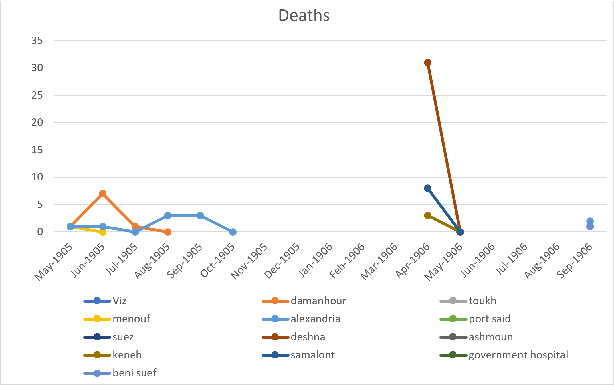
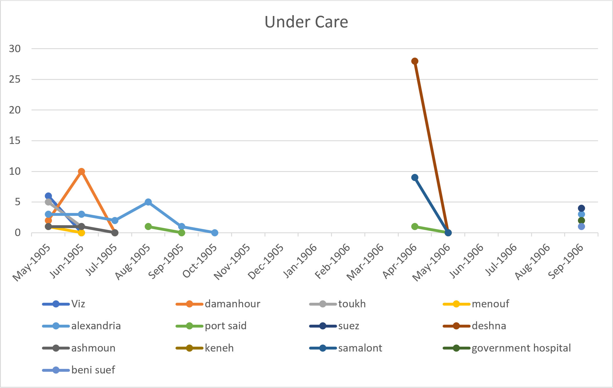
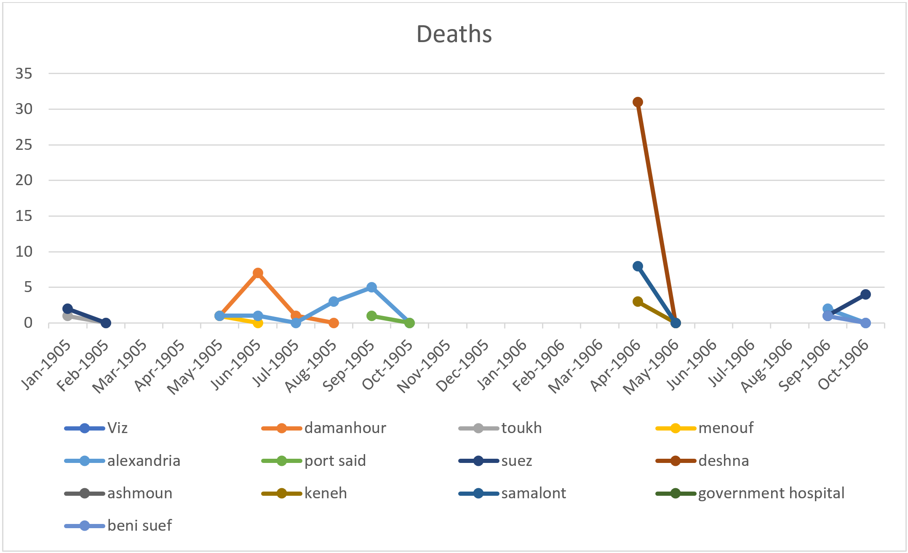
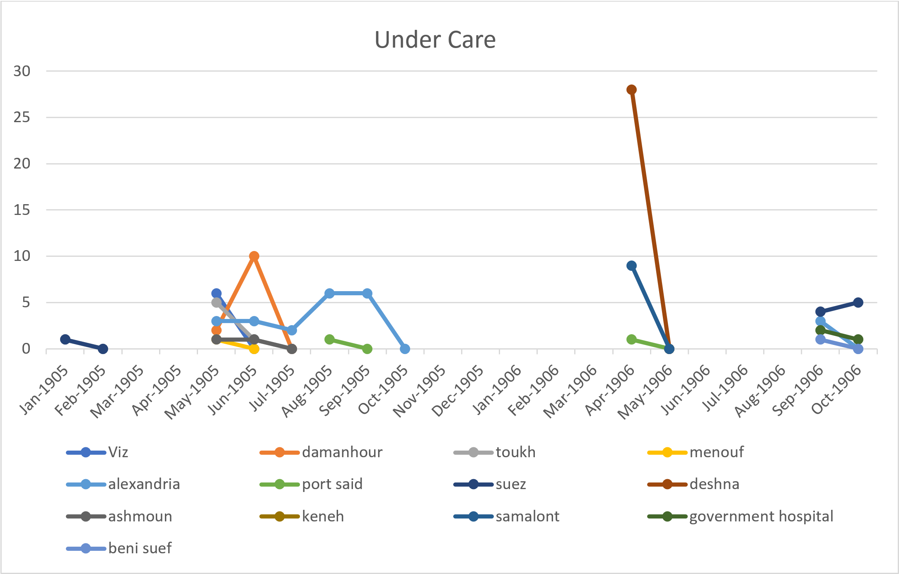

I have decided to write my analysis projected on the bubonic plague, but more specifically, how hospitals were affected over the span of year (1905-1906). This was during the third major outbreak that occurred in Asia. (more info here: http://www.nytimes.com/2010/11/01/health/01plague.html) By this time, some preventive methods and treatments were known so being cured from the plague was possible. Since the rate of infections was shifting during this time, I wanted to know how many people were being treated in the hospital (spots occupied) and how many died in the hospital per month. Instead of looking at overall deaths contractions of the plague, I would be looking at how the plague affected hospital during this time period. This question came to me while reading 'local and general' section of the gazette. I noticed there was an article for the plague that not only mentioned the recorded number of new cases and deaths of the plague but also how many were taken to a hospital and what happened to those patients.

To find the answer to my question, I had to construct an xPath query to search through the various gazettes. I started off by creating the query: ``//div[@type="item"][contains(.,'the plague')]`` . I noticed that this returned all items that mentioned the plague - even ads. So I changed my query to search for 'the plague' under the head tag. ``//div[@type="item"]/head[contains(.,'the plague')]``. I noticed that although this returned the correct type of articles I was looking for, it only returned some but not all. I realized that it was because on some it was typed as "THE PLAGUE" while others were typed as "The Plague", "the plague", or some other letter case variation. To solve that problem, I changed the query to ``//div[@type="item"]/head[matches(.,'the plague', 'i')]`` which uses the 'i' flag to ignore case sensitivity and just search for the phrase. Upon beginning to read through the results, I found that not all the articles about the plague mentioned anything about hospitals. Some just gave the total number of cases on the plague while others spoke about warnings or information on it. To ensure I only got back articles from the plague that also mentioned hospitals, I used the final query: ``//div[@type="item"]/head[matches(.,'the plague', 'i')]/following-sibling::p[matches(.,'hospital', 'i')]`` . By telling xPath to look for a paragraph sibling that mentioned 'hospital' I was able to find exactly what I was looking for.

To collect the data for my analysis, I sorted the numbers into two groups: the number of patients that were being treated and taking up space in the hospital and those that died in the hospital. For data accuracy purposes and to prevent any abnormalities, I ignored people that were brought to the hospital and found dead or any mentions of death or contractions outside of the hospital. These two groups were then further sorted by months. After collecting my data, I was able to construct the following graphs in Excel:
 

From this graph, I inferred two things:
A) There were a lot of months without any hospital data and
B) The number of patients being reported seemed low.

These results lead me to two further questions: 
1) For the missing months, was the plague not mentioned at all? Was no one admitted to the hospital for the plague during those months? and 
2) Was the low number of patients normal, above normal, or below normal when compared relatively to the amount of deaths or new cases being reported outside of the hospital?

To find the answer to the first question, I used the following query:
`` //div[@type="item"]/head[matches(.,'the plague', 'i')] )``
This way I could see what the gazette said about the plague each day and if there were some months that didn't report any cases or if it did but didn't report any hospital cases. While reading through the results however, I found that the gazette also wrote articles about the plague with the title "bubonic plague" instead of just "the plague". Some of these articles mentioned hospital reports so I ran a new query with: 
``//div[@type="item"]/head[matches(.,'bubonic', 'i')]`` (some entries were typed as bubonic plaque instead of plague)
This brought up new results that I hadn't seen before and re-populated my data with this new information. The graphs were slightly altered and generated this in Excel:

 
Still, even after these new data points, I was still missing a significant amount of months from my graphs. I returned to my previous query searching just for the plague and began to see if those missing months didn't in fact mention any death or new cases.
I found that:
* February started off with a clean start. New cases almost immediately were cured. Only 1 fatal case was reported.
* No articles on the plague was written for the month of March.
* April had low amount of cases reported. Only about 5 were reported.
* In October, Egypt was declared plague free on the 23rd
* In November, only one case was reported.
* No records of the plague were recorded between December of 1905 and March of 1906.
 
From these findings, I can conclude that the plague was in fact mentioned during these months and did have cases reported but only a handful and none were sent to the hospital.  This could be due to the decrease in cases throughout the years. The total number of reported cases in 1905 was 259 but in 1904 was 808.
From this query, I was also able to answer my second question. While comparing the number of deaths and new cases that happened outside of hospitals vs inside, I found that all cases and death outside of hospitals were either about the same or more than in hospitals. This leads me to conclude that the number of patients being recorded in the hospital was most of the time average or at times below average when it was compared to out of hospital records.

In conclusion, I definitely learned a lot about the plague and the process of filtering through various items to get what I needed. Starting the report, I thought that hospitals were going to be a large part of the plague and that there would rarely be reported deaths or new cases that were found outside of the hospital. Ending now, I see it’s the complete opposite. I believe this is because the plague had been going on for years now, and cure as well as prevention was being practiced during this time. In fact, so little reports of the plague came up that there were times Egypt was declared plague-free and when one or two cases came up, quarantines would be put into effect to prevent the spreading of the disease. All this was shown throughout the articles of the Egyptian Gazette. Although there wasn’t as much plague records as I wish I could have seen, this gave me some great insight to where they and their hospitals stood in the years of 1905-1906.