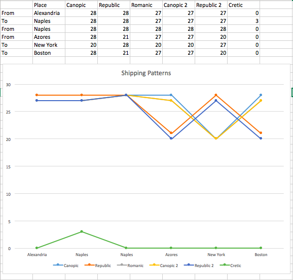
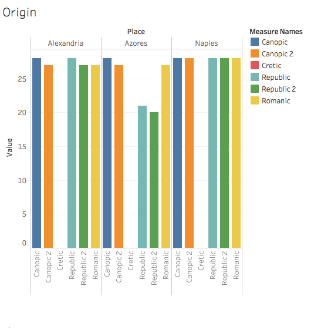
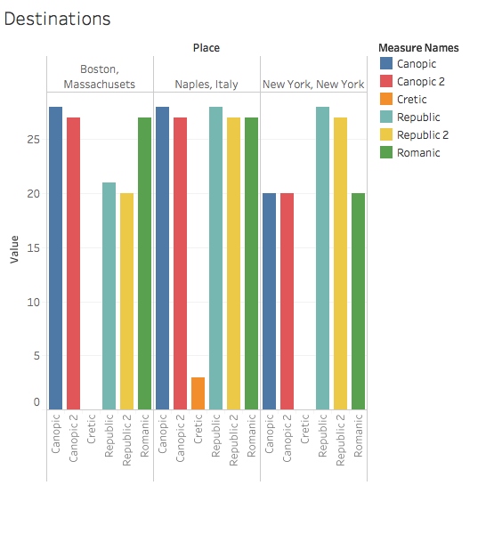

Working on the Deliverables over the course of the semester, the question that kept popping in my head was “Why Egypt?” So, naturally, my first instinct when it came to my Serial Question was finding a way to connect it to The United States. What I wanted to analyze was how often companies offered trips to New York, and where they were leaving from. My serial question was “How often do newspapers advertise passenger sailings to New York. In this post, I will analyze the connection of New York to the newspapers in Alexandria, especially the Egyptian Gazette. I think this analysis is quite relevant to people today because it lets us get a glimpse of our history. We are able to see how popular of a destination our country was to Immigrants in Egypt during the years of 1905-1906.

During the course of my research, I noticed that many of the occasions that involve ships moving to and from New York, the only cargo is imports and exports; not people. This made my data collection quite difficult because my data source was quite small. An example of this issue that I have come across in creating my query; not a lot of advertisements include New York as a sailing destination, but, for example, N. Spathis mentioned New York in a table, but it had nothing to do with sailing to New York, it only involved the shipping of whiskey and other items. This affected my query because I couldn’t simply look for items that contain the words "New York"

Over the course of my analysis, I realized that only one company had an advertisement for trips to New York and that was the White Star Line. My query only gave me around thirty occurrences of this ad in all the newspapers that are in the content folder. I soon realized that for all the 1905 issues, there was not a template available last semester, and only a few good students took the initiative to make their own template. As for the 1906 issues, a template for this ad was created only recently so, I can make a safe assumption that not many students have gone back and added in the template.

Some of the information that I have found is genuine, but most of the data that I have received is the same exact table. There are only two explanations to these results. One, Students have copied and pasted the template that was provided and never updated it to reflect the true data in the newspaper. Two, there are just so few occurrences of these sailings, that each advertisement that occurs in the results that I have, are exactly the same. Either one, the data that I was able to find is very lacking and I would have loved to see a lot more information and advertisements of ships sailing for New York.

Considering my lack of data, the graphs I made include shipping origins and destinations of all the ships mentioned in White Star line that included New York somewhere in their path. I noticed that not all of the Destination points, are also advertised as Origin points and vice versa in the "From"/"Due at" columns. For example, all of the ships from this ad leave Alexandria as their first point of origin, then, they head to Naples, which is advertised in the "Due Naples" column. The next column advertises Naples as the next point of origin in a "From Naples" column. However, they do not show the next destination. The next column states that they leave from Azores with a "From Azores" column, but never state when they are expected to arrive in Azores. The next destination is good old New York which has its own "Due at New York" column, but there is another mystery here as the column following states "Due at Boston", not giving any indication as to when exactly they are leaving New York. This ad also doesn't state when it leaves Boston back for Alexandria again which is also another odd characteristic.

In my analysis I observed one ship that is advertised as being named "Cretic", this ship is very different from the others, as it only travels to Naples from Alexandria and back. I find this interesting, because this implies that enough people and goods need to travel to Naples from Alexandria so much that they dedicate one ship to just these two locations.

The other ships travel to Naples quite a bit as well, New York and Boston have less occurrences, but it isn't drastically different. I also noticed that depending on the ship, your origins/destinations can change.

According to the graph above, both instances of the Canopic and the Romanic travel from Alexandria to Naples about the same amount of times, but the Republic didn’t stop at Azores the same amount of times as the Canopic. I also noticed the Canopic didn’t visit New York as much as the Canopic. I also compared the Romanic with the Canopic’s second advertised trip. The scheduled trips for both ships has exactly the same amount of trips to the same destinations, which I find interesting. Out of all of the shipping tables, the Republic was scheduled to go to New York the most.

In conclusion, although I didn’t get much data from the newspapers in the content folder, I concluded that there was enough people who wanted to travel to New York from Alexandria for a company to advertise sailings to said destination. From the data I was able to find, there was 115 instances that New York was advertised as a sailing point. However, I do not know how accurate these tables are because I do not know how many of the tables were just the template, and how many was true data from the given newspapers.

