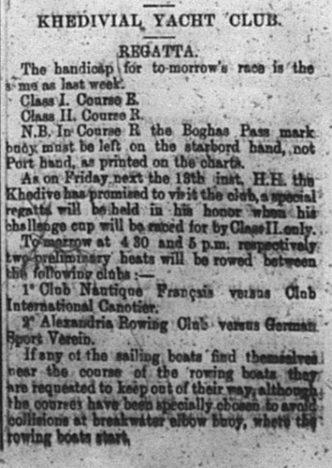
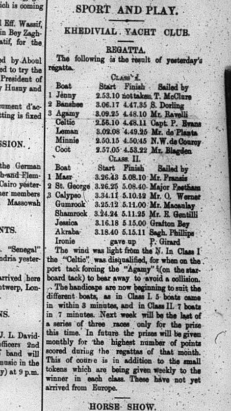
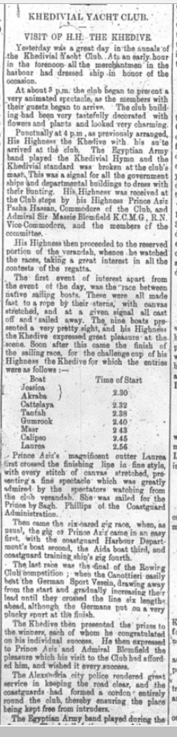
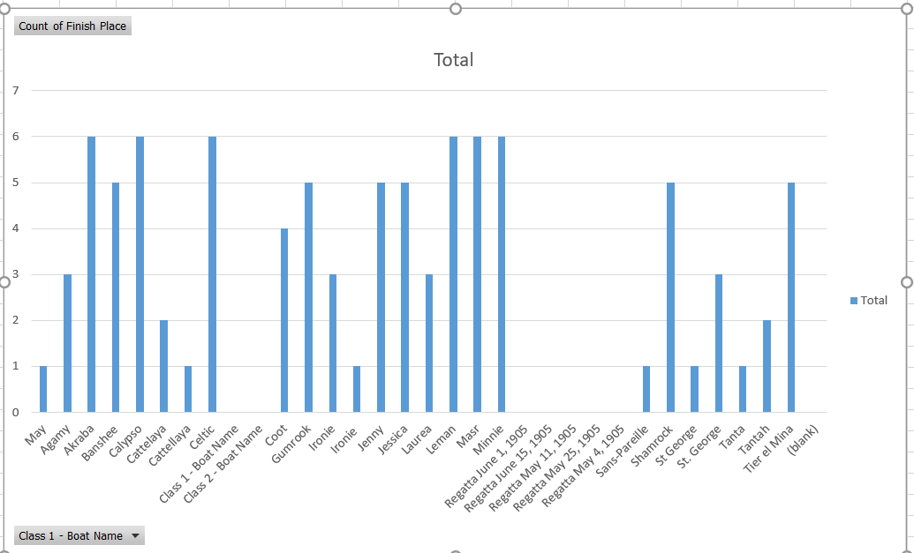
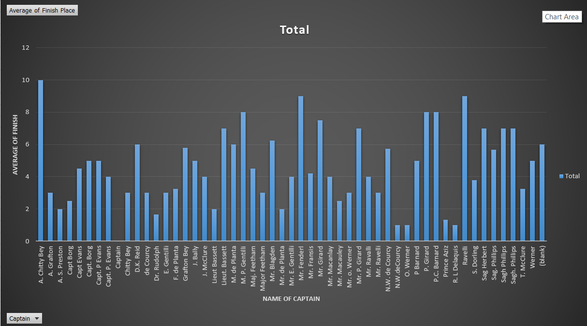

# Section 1

By looking at the history of the sport of sailboat racing during 1905 and 1906 in Egypt, one can learn several things about the culture. I looked for all sections throughout the 1905 and 1906 issues of the Egyptian
Gazette that mentioned the word "regatta". This brought back about 30 results in different issues, mostly in 1905. sailboat racing seemed to have been a popular recreational sport since it is in the newspaper almost every
week during the summer. The regatta section occured mostly in the third page of the issue and was under the sports section. The posts would vary from results to handicapping protocol for the upcoming regatta. There was also articles every now and then mentioning the Khedive watching the racing. It may have been a symbol of status of the yacht club or he may have just enjoyed watching the racing. There seemed to be a good amount of boats at each regatta and many of the same boats raced each week. It would have been interesting to learn how big the boats were and how many people crewed on this boats.

It was difficult to get this data since many of the xml versions of the paper had this article in a paragraph format. It was much easier to see the data when the editor put it into a table that matched how it looked on the actual newspaper. The order of the data was important since the places of the boats and the captains could get mixed up. It was also difficult in some cases to pull all the data from these sections. I ended up having to input it into Excel manually and make the graphs that way. Some of the boat names and captains names were spelt one or two letters different from week to week. This led to duplicates in the graph that were not truly different people or boats.

Almost every article I saw mentioned a handicapping protocol for the upcoming regatta. I have experince racing sailboats and am apart of the sailing team at Florida State. The handicap system is used today for racing against different types of sailboats. It adjusts your elapsed time to make faster boats and slower boats
 equal for a fair race. I think that the handicapping described in the Gazette is close to the same as the type we have today. The start times that are listed are the time of day that each boat starts the race and the finish time
 is the time of day that the boat finishes. It is not clear if the handicap was for the different boats or it was assigned to the skill of the captain.  This link explains a little bit about today's system to make racing between different boats as fair as possible.

 As viewers can see, the start times vary for each boat. The table also lists the Captains name, in which you can sometimes find a Prince, or Lieutinents steering boats in the races. This and the fact that the scoring is
 consistently in the paper, leads me to believe the races were for upper class citizens. It would be interesting to know what the yacht club was like. The paper doesn't really talk about how many members the yacht club had. Looking at the other evidence, I think that the club was upperclass and probably had social functions outside of sailing, like many clubs today.

 In this section of the newspaper you can see that the Khedive was coming to visit the yacht club, furthering the assumption that the racers were upper class.

 

 The article says how the Khedive enjoyed watching the racing. This articke also mentions the Rowing club which may have been apart of the yacht club. After inputing the data from several regattas into excel, I was able
 to create graphs that showed the amount of races as well as the average of each boats finishes. This data was mostly found in the summer months of 1905 issues. I found that most of the same boats particpated in every
  regatta, but the captain name would change every now and then. It was difficult to find some of the scoring articles since some people from the 1905 issues never uploading their page images and some were tables that
  were updated by OCR. It looks like they did as many as 20 regattas throughout the summer season. It is also interesting that as time passes, the race directors would update the handicaps and the finish times would
  get closer together.

 

 
