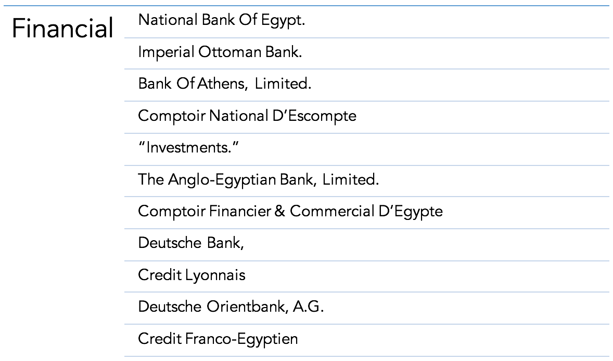
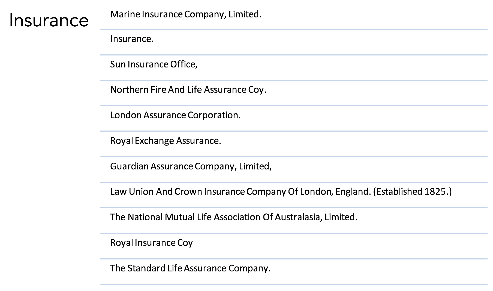
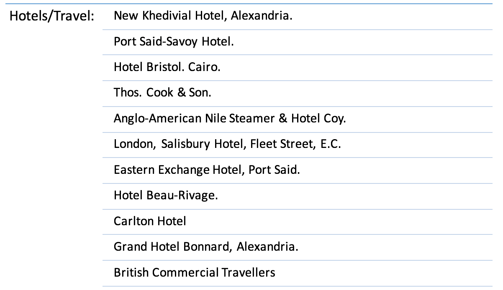
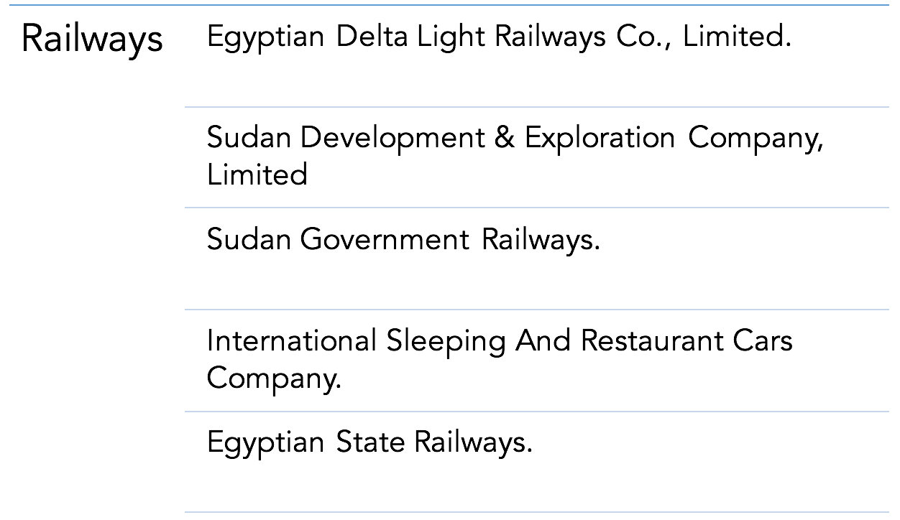
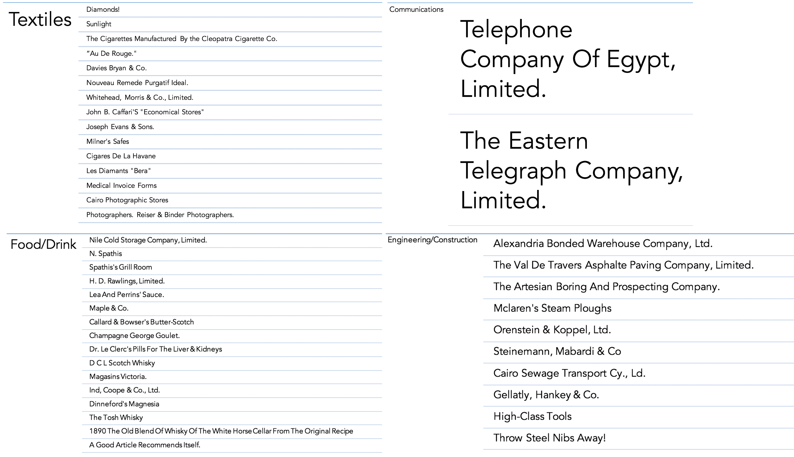

When looking at a newspaper, often times the first thing that can be seen is the front page and the information that it withholds. The Egyptian Gazette was a newspaper based out of Alexandria, Egypt that played a crucial role in informing its English- and French-speaking residents on the daily events that occurred within the city and around the world. Political, financial, and social happenings were also chronicled in addition to personal events during the late nineteenth and early twentieth centuries. A majority of the advertisements featured on the front page of this publication promote and advertise shipping and steamer companies that cater to this newspaper’s audience. This audience could consist of an average member of the working class looking to be a passenger and sail somewhere to find new opportunities, or to owners of corporations looking to transport industrial sized cargo from place to place in the most efficient way possible. However, when the prolific number of these advertisements are stripped away from the front page, only a handful of other advertisements are left, which left me wondering, of what importance do the products or companies being advertised bear to be featured on the front page?

First, to sort through and separate the advertisements that do and don’t advertise shipping and/or navigation lines, I utilized the XPath query feature on Oxygen XML Editor. The XPath query that I created ensured that the results produced would not contain any variation of the word “line”, which signifies that the post was advertising a shipping or sailing line. The final query I ran to find the results I used for this project was:

``//div[@type="page"][@n="1"]//div[@scope="advertisement"]/head[not(contains(.,"line"))][not(contains(.,"LINE"))][not(contains(.,"Line"))][not(contains(.,"linie"))]``

With this query, the content repository in which the existing files of the digital Egyptian Gazette are contained was searched through, yielding results of advertisements on the first page that do not contain variations of the word “line.” However, because of some inconsistencies with spelling and punctuation, there were some advertisements for shipping and navigation companies that made their way in. After the query was run, the results were first exported into Atom where the results were cleaned up using regular expressions, and then into Microsoft Excel. Microsoft Excel was quite more efficient with finding the leftover advertisements that did not fit the set criteria when compared to the XPath query. Using the Find and Replace tool, I searched for the terms “shipping” and “steamer” and deleted the results that were found and also removed duplicate advertisements, which left me with a list of names of companies that chose to advertise on the front page of the Egyptian Gazette.

The remaining results with which I was left gave me an idea of what different categories of “other” advertisements showed up on the front page of the Egyptian Gazette. I categorized the advertisements on the basis of whether they were Financial, Insurance, Hotel/Travel, Railway, or Miscellaneous advertisements. Below is a bar graph illustrating the number of different ads each category contains.

Since the front page seems to be a prestigious spot to place an ad, it is understandable only small numbers of companies from each category would choose to advertise here. Also, I broke down the “Miscellaneous” category into four subcategories (Textiles, Food/Drink, Engineering/Construction, and Communications). I believe that different advertisements that were featured on the front page were essential for the audience of the Egyptian Gazette to view and also reflected upon the needs of those living in Alexandria, Egypt in their day to day lives.

During the early twentieth century, Alexandria was a center for those who were seeking out opportunities for employment and financial gain. Thus, it would be logical for banks and credit unions to reach out to the readership of the Egyptian Gazette and grab their attention. These advertisements would catch the eyes of those who were making profits toward self advancement and who search for more ways to make more money, whether it is through investments or taking out loans. Different banks also present different offers, and a consumer would be able to weigh out their options as they decide where they would like to spend their money.

Along with finances, many were also looking for ways to insure their existing and newfound assets from what they have acquired from their stay in Alexandria. The variety of insurance companies advertising themselves aim to satisfy the demand of the different types of insurance needed to protect one’s property and life from the unexpected, especially when living in Alexandria during this time period. No one knows what troubling situations with which they could be faced, and it is crucial to secure one’s belongings while residing in such tumultuous conditions, politically and socially.

As mentioned before, Alexandria was a hub for people who were exploring their potential chances of becoming more financially successful. However, this meant many people were coming and going as they sought out each opportunity they could find. Many hotels were able to recognize these patterns and take the initiative to advertise to those looking for a place to stay in their short time in the city. In addition to merely hotels advertising, travel agencies, such as Thos. Cook & Son., also advertised on the front page to help plan different trips for people to get away from the city.

Although I chose to analyze what advertisements excluding those of shipping and navigation lines the Egyptian Gazette included on their first page, advertisements for railways also appeared to be quite prominent. Railways were an up and coming new mode of transportation and provided a more comfortable trip for those going longer distances over land. Many railway companies included sleeping or restaurant cars which would appeal to a sense of luxury a reader might be seeking when gazing upon the ads of the cover of the newspaper. Those reading the newspaper who might be of lower social standing might view riding a train as a lavish experience, and others of higher social standing might view this advertisement as convenient, but both parties are able to take in this information and indulge in what is being offered.

The remaining advertisements that have been subcategorized into the Miscellaneous categories consist of advertisements regarding textile manufacturers, food or drink, communications, or engineering or construction services. Since the Egyptian Gazette reaches such a wide range of people, the focus of these advertisements is to attract people of all classes and attempt for them to engage in the product being offered. Likewise, advertisements for engineering and construction would be more relevant from the years 1905-1906 more than ever because of the exploration of prospective land and construction to come. Many seek out ways to build upon that which has not been discovered yet, and coming upon an advertisement for a company that can help seek out opportunities for more success would benefit both parties in that situation. Also, the telegraph and telephone were up and coming new technologies as well, and advertising was necessary to help gain traction for the majority of the audience to invest in these devices. The wide variety of miscellaneous ads shows that not only does this newspaper reach the common housewife, with ads from John B. Caffari’s “Economic Stores,” but it also reaches perhaps an owner of a company who is seeking to expand.

Newspapers were probably the main source of information back in the late nineteenth and early twentieth century, before the rise in popularity of devices such as telephones and televisions, and seemed to be crucial in how people in Alexandria knew what was happening. All kinds of people were able to be given the equal opportunity to be in the know of the events of that day. Many companies saw this chance to reach different demographics and took it to hopefully gain business from advertising within the publication. The abundance of advertisements for shipping and navigation lines made it clear that Alexandria was a central location for many travelling to and from the city, but the advertisements surrounding them painted a clearer picture of how those residing in Alexandria went about their lives.
