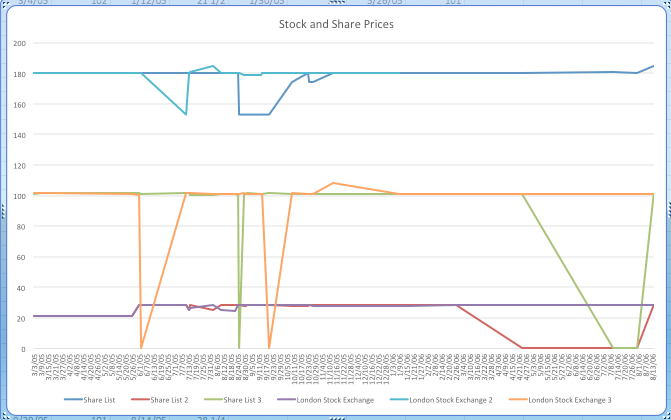

The Daira Sanieh was the largest state-run company in Egypt during the nineteenth century. According to [Samir Raafat](http://www.egy.com/historica/97-07-00.php), it was composed of the best sugar plantations in Upper Egypt, included four hundred and seventy kilometers of railroads, sixty-five locomotives and 2,092 wagons, nine sugar mills, substantial irrigation and drainage canals, Nile steamers, tugs and barges, warehouses, crops in the fields, cattle and even entire towns.The sale of the Daira Sanieh removed one hundred percent of the agricultural union to a private sector. It was a former khedivial estate which had been used as collateral for one of the ruler’s loans that had led him into debt. Even after twenty years of government management, Daira was still in the red. This simple arrangement led to a strong economic era of Egypt. At this time, the National Bank of Egypt was founded and a local landed gentry was formed. The Daira Sanieh was easily the primary source of Egypt’s boosted and rejuvenated economy.

It all began on June 21, 1898, when the arrangement and agreement were reached and the government officially sold the Daira Estates for £6,431,500 sterling. This sum matched the Daira’s outstanding financial obligation. It was three out of four of the new owners of the Daira Sanieh that created the National Bank of Egypt. With these two new enterprises of theirs, they were able to create an enormous number of jobs and export markets. Because the dams were able to provide Egypt with cheap electricity, Egypt’s first perennial irrigation was constructed.

When they began selling properties on the open market, they realized they had exceeded the loan amount because the value of the land continued to rise. They were quickly gaining huge profits on their investment. As time went on, they continued to strip assets by selling off the sugar mills, railways, and rolling stock to its newly incorporated sugar refinery.

It wasn't until 1900-1906 that the remaining three hundred thousand feddans (Arabic unit of area) of land were sold. It was this transaction that created the first generation of large landowners and entrepreneurs from outside the foreign classes.

From March 3, 1905 to August 13, 1906, the prices of the Daira Sanieh shares were recorded and extracted from the Egyptian Gazette. These share prices were taken from both the [London Stock Exchange](https://dig-eg-gaz.github.io/templates/#london-stock-exchange) list and the [Shares](https://dig-eg-gaz.github.io/templates/#share-list) list. The line graph below displays the prices fluctuating throughout the year and five months from which the data was extracted.

Before the data is fully analyzed, it should be known that there could be some discrepancies that could affect the results of this data. There are certain areas in the graph that display huge declines of the prices of the shares. Although it may be possible the interpretation could be incorrect, it is very unlikely for these prices to have declined so drastically in a matter of a couple of days. It is believed this data could have been incorrectly submitted or not edited from the template given in class.

First, the London Stock Exchange prices will be analyzed. Some instances to take note of could be found in the London Stock Exchange 3 (orange line) on June 2, 1905 and August, 20, 1905. Other than these two instances, the price tends to stay pretty consistent throughout the span of approximately a year and a half. There is another noticeable instance when the price spiked from 101 to 108 in the matter of less than a month between October 23, 1905 and November 13, 1905. As represented by the London Stock Exchange (purple line), around June 1, 1905 the stock began to rise from 21.5 to 28.125. From then on, it continued to stay consistent at this price until around July 13, 1905. It was at this time the price dipped, no lower than 24, for about a month and quickly rose up to 28.125 a stock. As displayed by the blue line, the London Stock Exchange 2, has some noticeable spikes in price. Up until July 11, 1905, the price stayed consistent at 180 per stock. It was on July 11th that it declined drastically to 153. Other than a small peak in August 1905, the price didn't change very much until it began rising around July 31, 1906.

Second, the Share List is analyzed. Very similar to the London Stock Exchange, the prices stay very consistent except for a couple of strange incidents. Beginning with the Share List (dark blue line), the price stays at 180 up until August 25, 1905. It was at this time the price fell to 153 and stayed there until September 20, 1905. From then until October 23, 1905 the price progressively began to rise to 180 again. Other than a small decrease in price in November, the price leveled out at 180 the remainder of the time. After a rough start off for Share List 2 (red line) the price remained at about 28.25 per share. It wasn't until April 24, 1906, that there is an extreme drop fall in price. Because the data shows that from February 26, 1906 until July 10,1906 is valued at zero, I believe this is only an error due to lack of data that was input into these templates. I believe this is too much of an extreme decline to be actual data from 1906. Lastly, the Share List 3 has a very similar pattern to the London Stock Exchange 3 line. The prices stay within a certain pattern and range up until August 22 until August 28, 1905. This dramatic fall I believe is also due to data that was untouched and not inputted.

After analyzing this data, it is obvious something had occurred between June and September of 1905. Although I have not found exactly what occurred around this time, just by reading the data it has become evident that price variations have to have been caused by something pretty drastic at the time. I believe it could be a slight change in economic standing, but there are also many factors that go into these price changes.

# Source
Samir Raafat, "[THE 19TH CENTURY PRIVATIZING OF DAIRA SANIEH](http://www.egy.com/historica/97-07-00.php)," _Business Monthly Magazine_, July 1997.
