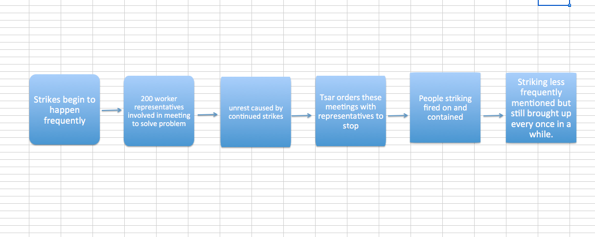

#Strikes in St. Petersburg
I started searching for information on St. Petersburg by putting in the XPath query `//head[contains(.,"st.petersburg")]`.  This did not bring up any results so I then modified my search to contain a capital S and P with a space in between the two words.  My new XPath query became ``//head[contains(.,"St. Petersburg")]``.  This brought up 722 results.  I then decided to narrow my search to just articles about St. Petersburg concerning war.  To find results with both St. Petersburg and war I changed my XPath query to
//head[contains(.,"St. Petersburg")]//p[contains(.,"war")].  I did not find any results with this query so I then went through articles containing St. Petersburg looking for important information.  I found that in many articles involving St. Petersburg acts of violence and Russia are mentioned.  For example, on February 10, 1905, an article titled “CONDITION OF RUSSIA. WARSAW HOSPITALS FULL. PROBABLE RESUMPTION OF STRIKE,” talks about the number of people from St. Petersburg killed at Warsaw.  The casualties did not exceed 100 people, however people were angered by their loss and many had planned to preform a strike on the following Sunday.  This article also addresses the frequency of these strikes throughout Russia.  The paper states that these strikes happen often, so I decided to look into strikes in St. Petersburg.

Overall the striking was talked about mostly in the month of February.  It is mentioned again on the next day’s newspaper in February and then constantly after that.  From what I can tell, these strikes were a result of people’s frustrations with the war. In February 20, 1905’s paper it states that on February 18, 1905’s St. Petersburg was dealing with an even worse strike. “The strike here is again rapidly extending. 30,000 men have rejoined the strikers, whose temper is now more threatening than during the previous period.” (page 2)   

People proactively try to solve the strike problem in March of 1905.  This first meeting workers were allowed to attend about this was held in St. Petersburg.  This meeting involved 200 electors.  The job of these electors was to represent the workers.  According to an article titled “MEETING OF WORKMEN,”(1905-03-03 page 3) “the electors refused to carry out their task unless 3,000 workmen, who had been arrested since the 22nd January last, were immediately released, and that other demands, including the inviolability of person and domicile, together with freedom of speech and
press, were granted.” All of these demands and strikes cause an overall sense of unrest in Russia and the paper even refers to this time as having an “epidemic of strikes.”  Again in March these workers meet and it is decided that their demands need to be met soon.  The paper notes that many people are worried of disorder on the anniversary of the liberation of the serfs happening the next weekend. On March 4th it is noted that, “The Strikes have increased here. 51000 strikers are now out. Yesterday passed quietly.”(1905-03-06 page 2)

Despite the increasing amount of unhappy workers, on March 7, 1905 the Tsar orders that the labor commission with the representatives be closed.  On March 9, 1905 another report on striking appears in relation to the men of the Baltic Navel dockyard in St. Petersburg.  This leads to the arrest of their elected representatives.  

In April of 1905 two thousand strikers were preventing comrades from resuming work at the Putiloff workshops.  Police shot at these strikers until they dispersed.  Then they all stood together in a specific area that was strongly patrolled.  After this incident, not many more articles address the strikes caused by war.  I’m not sure if this is because people started focusing on the more news worthy war or if people began to give up on their demands.  

Overall, the strikers in St. Petersburg and their struggles reported in the newspaper act as a cultural comparison with our current society.  I find it odd in general how the people had a problem, the government recognized this problem and formed a plan to solve it, then the Tsar disbanded the whole group working to solve the problem.  This makes no sense to me because I have grown up in a democracy with representation.  The way these strikes are handled in 1905 is so different than how they would be handled now.  Also shooting on citizens protesting would be unheard of now and in the United States of America, but then it was written about in the paper one time and then not mentioned again until July 3, 1905.  Did this issue resolve itself, or did the government just instruct the newspapers to no longer report on it?  It seems odd to me that a whole shooting is reported on so vaguely and quickly.  I believe the people in charge of the government might have forced the paper to stop reporting on strikes in order to prevent it from becoming supportive propaganda for the strikers.  

After this incident, strikers are mentioned as whole more often and never specified as a specific group striking in St. Petersburg.  This supports my idea that the government was monitoring news and spinning the way citizens were fed information in order to maintain peace.  On the other hand, it is possible that people complied out of fear after this incident.  Below is a flow chart of the main events in 1905 that concerned strikers in St. Petersburg.

I would conclude that this issue did not resolve itself but was just covered up for a few months because again in July 3, 1905 strikes are mentioned in reference to St. Petersburg.  “A general strike has broken out among the workmen of the docks here.
Work is at a complete standstill. 50,000 troops are concentrated in the city.”  (1905-07-04 page 3)  Although this shows us that the strikes are not fully resolved, maybe it does show that the strikes are becoming less frequent.  If people had a strike that was continually failing, it would make sense that they slowed down and went on strike less often. 

       
